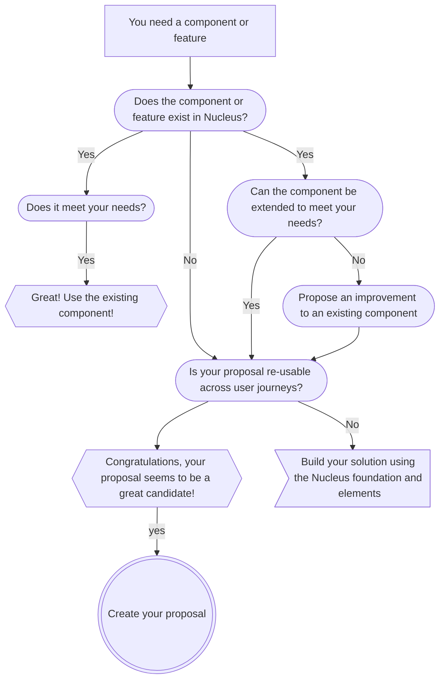

> Our design system is a living organism, one that reflects and evolves with our collective learning.

Now that we have a mature system that is utilised across the entire British Gas website, we need to make sure that any changes to the system add value to our customers and also to all the teams that use Nucleus.

Because of this we may ask for you to to show a more detailed use case, analytics or testing that proves it will add value. This is to make sure that the whole community has a clear understanding of why a change has been made.

## Contributing

The Nucleus team is looking after the system, making sure all of its parts work in a symbiotic way. Contributions can be made at every level, by anyone who has an idea on how to take it further. Whether it is a component, a pattern, a change to the documentation, the prototyping tool, every part of the system is open to contributions.

### What is a contribution?

- A contribution adds value to the system.
- A contribution can be something new, an improvement on an existing part of the system, or a bug fix.
- A contribution is re-usable.
- A contribution is inclusive and accessible.
- A contribution is documented.

### Who can contribute?

Everyone.

Whether you are a designer, a software engineer, a tester, a solutions architect, a product owner, or a director: everyone is invited to advance Nucleus.

## What to expect?

Everyone plays a part in creating a coherent, consistent and engaging customer experience.
We worked with product teams to set up a contribution flow that makes sure a contribution ticks all the boxes to get added to the system.

### Is your idea a candidate for a contribution into the system?

The simple answer is that if your idea is: 
- [x] re-usable by another team/journey than yours
- [x] a solution to a new problem or an extension of an existing solution

...the chances are your idea would be a great contribution!

The chart below will help you what to do: 

### First step: creating a proposal

If what you have in mind is not currently offered by Nucleus, it's re-usable by multiple teams or user journeys, it's solving a problem that can't be solved currently, then you have proposal material! 

Before raising your proposal, it's worth checking [on the proposal board](https://github.com/ConnectedHomes/nucleus/projects/6) that there isn't someone already trying to contribute a similar idea.

If nothing similar has been raised, then go ahead and [create your proposal](https://github.com/ConnectedHomes/nucleus/issues/new?assignees=&labels=RFC,+draft&template=b--request-a-change.md&title=[RFC]+Title+of+the+request).

Make sure you give as many details as possible and answer the questions on the ticket template, these will help us understand what you're proposing and make sure it checks all the boxes to go forward.

### Collaborate

As your proposal is for something that has reusability potential, it's time to involve those teams that may have an interest in it. Reach out to your colleagues see if they may have requirements that will help them use your contribution once it's available. 

Bring your proposal to the Drop-in Clinique, it's a great way to get feedback and interest from others! 

Remember that **you are the main sponsor of your proposal**, but we're there to support you if you need us.

### Contribute

You're ready to start working on your contribution!

- Add any user research into the proposal ticket by commenting on it: user analytics, usability testing, A/B testing, etc...
- Share your final designs with the wider design team, and the Nucleus team for feedback;
- Start building your contribution with your product engineer;
- Start putting a documentation for your contribution (adding to an existing doc, or creating a new one, we can help with that);
- Once it's ready to be reviewed by the Nucleus team, share the pull request with us so we can see if it's built following Nucleus coding standards for components. 

A contribution is usually made of: 
- [x] a design for a component/variant/feature that can be added to the design libraries (Sketch/Figma)
- [x] a built component/variant/feature that can be added to our component library
- [x] unit test for the component
- [x] automated testing scenarios

The best way is that you and your team own as much of the above as possible, but we can support on any of them if you need us.

Once everything looks good to go, your contribution can be part of the next release and will be available to everyone using Nucleus! 

Well done!

▼▼▼ older content of the contribution page ▼▼▼

### Insights on existing Nucleus assets

For any feedback related to our Nucleus components and related documentation, we're using Github. This helps us provide a transparent track of all contributions and potential issues.

1. You can view our [proposals status](https://github.com/ConnectedHomes/nucleus/projects/6).
2. You can create [bug reports](https://github.com/ConnectedHomes/nucleus/issues/new?assignees=&labels=Bug&template=a--bug-report.md&title=[bug]%20[ns-COMPONENT]), add a new [change request (RFC)](https://github.com/ConnectedHomes/nucleus/issues/new?assignees=&labels=RFC,+draft&template=b--request-a-change.md&title=[RFC]+Title+of+the+request), as well as react or comment on existing feedback.
3. We've prepared a template to structure incoming feedback, gather relevant insights, and help us respond accordingly.
4. If and once an issue is picked up, we'll ask to meet you to swap ideas and listen to your insights or make use of weekly design critique sessions.

### Suggestions for new Nucleus assets

We're working hard to grow Nucleus without sacrificing quality.

1. You can track and add suggestions for new assets in Github by checking our [requests status](https://github.com/ConnectedHomes/nucleus/projects/6).
2. Feel free to explore the styles and assets provided to suggest new components.
3. Please make sure to submit your experiments and learning. It helps us to track potential variations and roll out stable additions to all teams via Nucleus.

To understand how the Nucleus team works, visit [Our Process](getting-started/our-process.md).

### Feedback on anything related to Nucleus

Reach us on Slack, via `#product-nucleus`. If there's anything on your mind.

### Events and updates

We know we don't have all the right answers, that's why we want to work with you in person, as well as connect you to other teams dealing with similar issues.

* We help to host and facilitate sessions and workshops focused on our current tasks as we go along. If you'd like us to help organise or be involved in something you're doing, do let us know.
* Just like other product teams, we're participating in weekly and monthly cross-team ceremonies.

