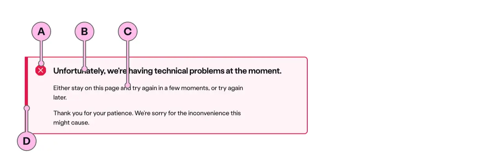
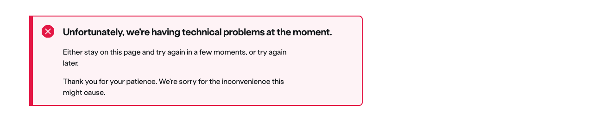
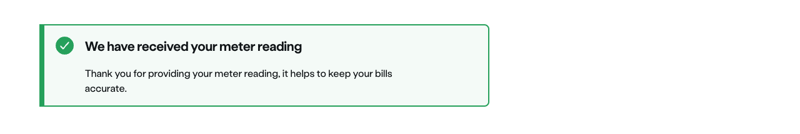
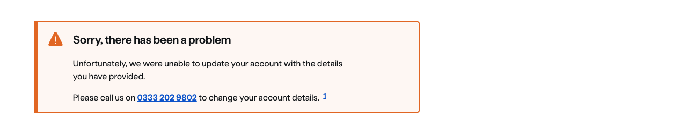

import { StorybookStory } from '../../includes/storybook-story.js'
import { ComponentPlacement } from '../../includes/component-placement.js'
import { PageFooter } from '../../includes/page-footer.js'

## Introduction

> Alert can be used to communicate contextual messages to the customers.

**Important**  It has an ARIA role of `alert`, which brings the immediate attention of its content to the user. It should be used for its role and not for its look.

## Highlighter variant

The `highlighter` variant of `ns-alert` can be used to communicate information or error, warning and success messages.

It communicates the message that a service is not available to them or that there are technical issues on specific pages only. These messages are different to global messages as they only apply to some pages not site wide.

e.g. a message that says the top up service is not available would only apply to pages that customers will look at in order to top up.

### Content guidance

#### Highlighter variant

| Key | Field type | Guidelines |
| :--- | :--- | :--- |
| A | Icon | This is the icon inside the `highlighter` type. This is dictated by the `state` of Alert. The [specification table](#specification) has a list of options. |
| B | Heading | The recommended length is between 4 and 12 words, not exceeding 50 characters in total. |
| C | Content | A single, short paragraph works best. You are able to use inline text links within the paragraph if necessary. Don't add additional headings within the paragraph and the copy length should not exceed more than two paragraphs of 3 lines each. Can contain bold copy `<b>`, inline links `<a>`, and a caveat at the end of the relevant paragraph if required `<a href="#caveat">1</a>`. |
| D | Accent | This is to support the context of the messaging. This colour matches that of the icon. |

The content for the  `highlighter` variant is dependent on the state that is used:

### Error messages

For communicating failure with urgence. A task cannot be completed without the user remedying something.

### Informational messages

For communicating a useful piece of information that the user might find helpful to carry out their action.

### Success messages

For communicating that an action has been successful.

### Warning messages

Use for communicating a piece of information with less severity. These include foreseeable problematic events, failures, outages and how to avoid errors.

## Accessibility 

The information contained in the alert should always be the most important information on the page. To ensure that screen reader users are informed about the importance of these messages the content is read aloud as soon as the alert type is used. This could be when the page loads or when it is dynamically added to a page.

If there are multiple alerts on a page they are read:

* from top to bottom on page load
* in the order they have been added to the page when dynamically added

### Considerations of best practice

* Be clear and concise

The message must be in plain English, and help the user out of the situation by providing an actionable link if possible.

## Best practice

### Highlighter variant

| 💚 Do's | 💔 Don'ts |
| :--- | :--- |
| Keep the messages concise |  Use for generic message that is not in context to the page it is displayed in |
| Use an icon to alert the user what type of message it is |  Use it for Roadblock error messaging |

## Usage

<StorybookStory story="components-ns-alert--error"></StorybookStory>

## Component placement

<ComponentPlacement component="ns-alert" parentComponents="ns-form,ns-panel"></ComponentPlacement>

## Specification

| Attribute | Property | Type | Default | Options | Description |
| :--- | :--- | :--- | :--- | :--- | :--- |
| `type` | `type` | `string` | `standard` | `standard`, `highlighter` | Type of alert to use |
| `state` | `state` | `string` | `error` | `error`, `success`, `warning`, `info` | Defines the role of the highlighter and changes the styles |

| Event | Description |
| :--- | :--- |
| `close-alert` | Will be dispatched when the alert is dismissed. |

| Slots | Type |
| :--- | :--- |
| `heading` | `h tag` |
| Anonymous | `p tag` |

## Feedback

* Do you have insights or concerns to share? You can raise an issue via [Github bugs](https://github.com/ConnectedHomes/nucleus/issues/new?assignees=&labels=Bug&template=a--bug-report.md&title=[bug]%20[ns-alert]).
* See all the issues already raised via [Github issues](https://github.com/connectedHomes/nucleus/issues?utf8=%E2%9C%93&q=is%3Aopen+is%3Aissue+label%3ABug+[ns-alert])

<PageFooter></PageFooter>