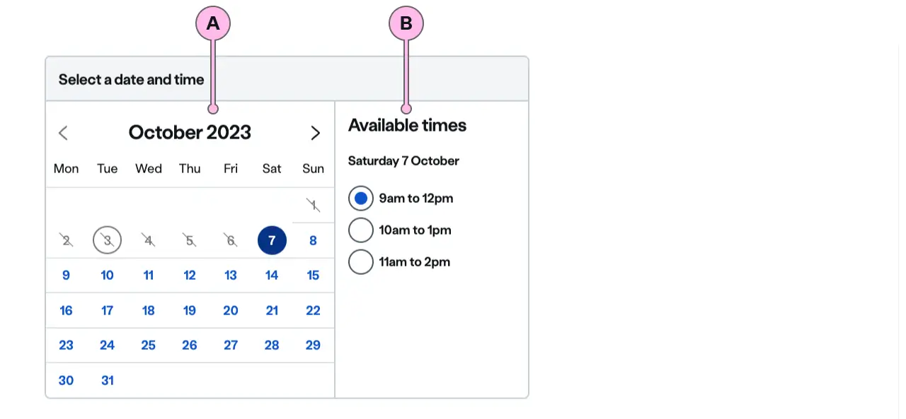

import { StorybookStory } from '../../includes/storybook-story.js'
import { Tokens } from '../../includes/tokens.js'
import { ComponentPlacement } from '../../includes/component-placement.js'
import { PageFooter } from '../../includes/page-footer.js'


## Introduction

> `ns-appointment-picker` is used to select a date and time slot for an appointment.

`ns-appointment-picker` is used to select a date and time slot for an appointment. The component is comprised of an `ns-calendar` to pick the date, and an `ns-slot-picker` to show the available time slots.


## Best practice

| 💚 Do's | 💔 Don'ts |
| :--- | :--- |
| Use this when the customer needs to select a date and a time slot for an appointment | Use to select an appointment slot on a single date. Use `ns-slot-picker` instead |
| Use `ns-slot-picker` to surface the best suitable slots for a customer before presenting the full appointment picker, where appropriate. | Don't force customers to use the appointment picker first if there is very poor appointment availability. Present the next available appointments in a slot picker first. |
| Use `ns-highlighter` alongside `ns-appointment-picker` to surface any important notifications regarding a customer booking.| |
| Use multiple appointment pickers in ns-tabs so users can easily access different types of bookings.| |


## Usage

<StorybookStory story="components-ns-appointment-picker--standard"></StorybookStory>

The main property/attribute of `ns-appointment-picker` is `slotData`.  This would typically be set by setting the property through code as it is a fairly complex object.

## Usage example



| Key | Description | 
| :--- | :--- |
| A | `ns-calendar` - Calendar component|
| B | `ns-slot-picker` - Slot picker component |


## Specification

| Attribute | Type | Default | Options | Description |
| :--- | :--- | :--- | :--- | :--- |
| `slotdata` | `array` | | | Array of objects representing dates.

| Event | Description |
| :--- | :--- |
| `change` | Dispatched when a specific slot is selected

### Slot Data

The slotData array should consist of objects containing a date property and a slots property.

date: String - eg. 2020-01-28 (28th January 2020)
slots: Array of objects with a name and value property 

```js
const slots = [{
  name: '9am to 12pm',
  value: '0900-1200'
}, {
  name: '10am to 2pm',
  value: '1000-1400'
}, {
  name: '12am to 5pm',
  value: '1200-1700'
}]

const slotData = [{ date: '2020-01-28', slots: slots }, { date: '2020-01-29', slots: slots }];

```

## Component placement

<ComponentPlacement component="ns-appointment-picker" parentComponents="ns-form,ns-fieldset"></ComponentPlacement>

## Feedback

* Do you have insights or concerns to share? You can raise an issue via [Github bugs](https://github.com/ConnectedHomes/nucleus/issues/new?assignees=&labels=Bug&template=a--bug-report.md&title=[bug]%20[ns-appointment-picker]).
* See all the issues already raised via [Github issues](https://github.com/connectedHomes/nucleus/issues?utf8=%E2%9C%93&q=is%3Aopen+is%3Aissue+label%3ABug+[ns-appointment-picker]).

<PageFooter></PageFooter>
