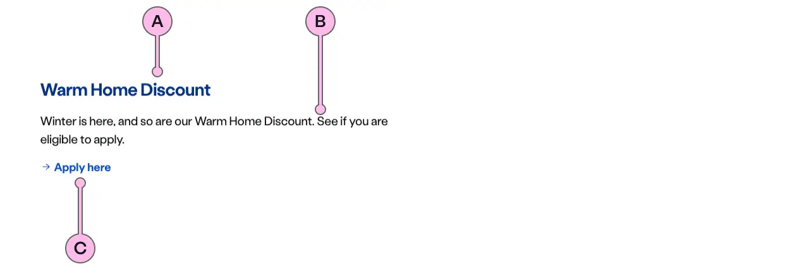
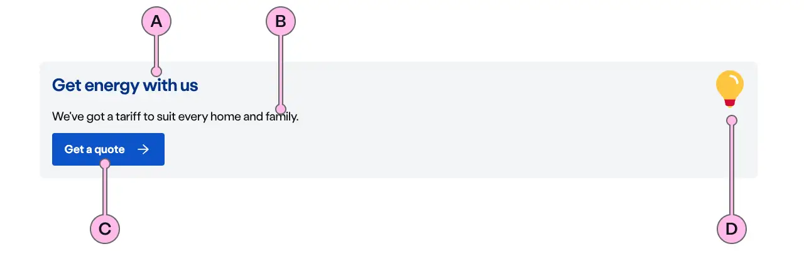

import { StorybookStory } from '../../includes/storybook-story.js'
import { ComponentPlacement } from '../../includes/component-placement.js'
import { PageFooter } from '../../includes/page-footer.js'

## Introduction

> Cards can be used to contain content in a consistent and structured way.

Cards are used to apply a container around a related grouping of information; this can be done through imagery, illustrations and typography.

## Content guidance


### Flat Card



| Key | Field type | Guidelines |
| :--- | :--- | :--- |
| A | Heading | The recommended length is between 4 and 12 words, not exceeding 50 characters in total. Headings contain light and bold font weight to highlight key messaging. |
| B | Content | A single, short paragraph works best. You are able to use inline text links within the paragraph if necessary. Don't add additional headings within the paragraph and the copy length should not exceed more than two paragraphs of 3 lines each. Can contain bold copy `<b>`, inline links `<a>`, lists `<ul>` `<ol>`, and a caveat at the end of the relevant paragraph if required `<a href="#caveat">1</a>`. |
| C | CTA | Keep the text ‘short, relevant, and actionable’. It should not exceed more than 24 characters. |


### Section Card



| Key | Field type | Guidelines |
| :--- | :--- | :--- |
| A | Heading | The recommended length is between 4 and 12 words, not exceeding 50 characters in total. Headings contain light and bold font weight to highlight key messaging. |
| B | Content | A single, short paragraph works best. You are able to use inline text links within the paragraph if necessary. Don't add additional headings within the paragraph and the copy length should not exceed more than two paragraphs of 3 lines each. Can contain bold copy `<b>`, inline links `<a>`, lists `<ul>` `<ol>`, and a caveat at the end of the relevant paragraph if required `<a href="#caveat">1</a>`. |
| C | CTA | Keep the text ‘short, relevant, and actionable’. It should not exceed more than 24 characters. |
| D | Illustration | Use to support and highlight the content. The illustration should relate to the product or service you are talking about. The [specification table](#specification) has a list of options. |

### Support Image Card


| Key | Field type | Guidelines |
| :--- | :--- | :--- |
| A | Heading | The recommended length is between 4 and 12 words, not exceeding 50 characters in total. Headings contain light and bold font weight to highlight key messaging. |
| B | Content | A single, short paragraph works best. You are able to use inline text links within the paragraph if necessary. Don't add additional headings within the paragraph and the copy length should not exceed more than two paragraphs of 3 lines each. Can contain bold copy `<b>`, inline links `<a>`, lists `<ul>` `<ol>`, and a caveat at the end of the relevant paragraph if required `<a href="#caveat">1</a>`. |
| C | CTA | Keep the text ‘short, relevant, and actionable’. It should not exceed more than 24 characters. |
| D | Image | This is the image that will be used above the ns-card. It should have an aspect ratio of 16:9, the dimensions should be 640x360px, the file type should be jpg, and the file size should be no more than 50kb. Don't use imagery with white backgrounds. |

### Image guidance

| Component | Variant | Ratio | Dimensions | Size | Type | Placeholder |
| :--- | :--- | :--- | :--- | :--- | :--- | :--- |
| `ns-card`| `support` | 16:9 | 640x360px | &lt; 50kb | jpeg | [ns-card-support-640x360px](https://user-images.githubusercontent.com/50207859/67642149-d3c91e00-f900-11e9-983c-9b812217b801.jpg) |

## Best practice

| 💚 Do's | 💔 Don'ts |
| :--- | :--- |
| Always use them in the triple layout | Use the text CTA in the section card |
| Use to direct customers to the actions | Mix card types in a row |
| Embolden text in the paragraph that is important | Have two or more cta's for a card |
| Make your CTA copy unique, stating the action | Repeat the CTA copy in each card |
| Use section cards to navigate users to primary actions | Use inline links in the paragraph |
| Consider using decoration in the panel to add emphasis on the cards | Use the section card without a decoration |

### Considerations of best practice

* Consider your CTA type and try to keep them consistent between rows across the cards, unless there is a need.
* There can be less than three cards in a row, but it should always use the triple layout. Always consider a lockup for this, before using the cards.
* Headings work best with one to four words.
* Please check the imagery guidelines when adding an image to the card.
* Be careful when using decoration in the panel with the section cards as the blue on blue with the CTA's will make them not accessible.
* There should always be a heading to the group of cards inside the panel.

## Usage

### Section

<StorybookStory story="components-ns-card--section"></StorybookStory>

### Using with action

```markup
<ns-card type="support" decoration="bulb">
  <h3 slot="heading">Get energy with us</h3>
  <p slot="paragraph">We've got a tariff to suit every home and family.</p>
  <div slot="action">
    <!-- action content ns-cta/ns-form -->
  </div>
</ns-card>
```

### Using with ns-pill

To add a `ns-pill` to the card it needs to be placed inside one of the slots. Be careful about using it within the heading slot, as the pill content will be read out as part of the heading for screen readers.

If you have a group of cards, try to make sure that the pill is placed in the same location throughout those cards. This will make improve the readability of the cards.

#### Screen readers with ns-pill

```markup
<ns-card>
  <h3 slot="heading">
    <ns-pill>Special Offer</ns-pill>
    Get energy with us
  </h3>
  ...
</ns-card>
```

In the above example the screen reader will read out "Special Offer Get energy with us". Make sure that is what is expected. Remember the pill cannot be used on its own within a heading. Our advice is to rarely put pills in headings as they are normally conveying a message related to the heading, but is not heading content.

#### Pill over image

If using with a type of `support` with an image. There is also the option to place the pill over the image using the `pillOverImage` attribute. Note the `ns-pill` will need to be in the `paragraph` slot as it is no longer related to the heading.

```markup
<ns-card type="support" image="path/to/image" pill-over-image>
  <h3 slot="heading">
    Get energy with us
  </h3>
  <p slot="paragraph">
    <ns-pill>Special Offer</ns-pill>
    ...
  </p>
  ...
</ns-card>
```

More details on how to use the ns-pill can be found on the [ns-pill documentation](components/ns-pill.md)


## Component placement

<ComponentPlacement component="ns-card" parentComponents="ns-panel,ns-caveat,ns-tabs"></ComponentPlacement>

## Specification

| Attribute   | Property | Type | Default | Options | Description |
| :------ | :--- | :--- | :--- | :--- | :------------- |
| `alt`        | `alt`        | `string` |           |           | The alternative text for the image |
| `decoration` | `decoration` | `string` |           | See [Illustration component in Storybook](https://britishgas.co.uk/nucleus/demo/index.html?path=/story/ns-illustrations--standard) and See [Icon component in Storybook](https://britishgas.co.uk/nucleus/demo/index.html?path=/story/ns-icon--error) | Illustration that is shown in the section type card and Icon used in ns-highlighter |
| `image`      | `image`      | `string` |           |           | Adds an image above the card content for the support card |
| `type`       | `type`       | `string` | `section` | `section`, `support`, `flat` | Defines the role of the card and changing the style |
| `pill-over-image` | `pillOverImage` | `boolean` |   |   | Used to put the pill in the top left of the image when using `type="support"` and an image | 

### Support and Flat

| Slots        | Type                | Description |
| :--- | :--- |
| `heading`    | `h tag` |  |
| `paragraph`  | `p tag` |  |
| `action`     | `ns-cta`, `ns-form` |  |
| `cta`        | `ns-cta` | Deprecated |

### Section

| Slots        | Type                |
| :--- | :--- |
| `heading`    | `h tag` |
| `paragraph`  | `p tag` |
| `cta`     | `ns-cta` |

## Specification notes

### Decoration

* Required if the type is section

### Image

* Images are always at a ratio of 16:9

### Heading

* This should be a heading level 3


### Action

* Action is used to hold interactive content e.g. buttons, forms, etc
* On `support` and `flat` types the action slot is not shown if the deprecated cta slot is used

### CTA

* Only for `section` types
* This should be an anchor with the [ns-cta](../components/ns-cta) or just the [ns-cta](../components/ns-cta)

## Feedback

* Do you have insights or concerns to share? You can raise an issue via [Github bugs](https://github.com/ConnectedHomes/nucleus/issues/new?assignees=&labels=Bug&template=a--bug-report.md&title=[bug]%20[ns-card]).
* See all the issues already raised via [Github issues](https://github.com/connectedHomes/nucleus/issues?utf8=%E2%9C%93&q=is%3Aopen+is%3Aissue+label%3ABug+[ns-card]).

<PageFooter></PageFooter>

## Related links

* [ns-pill](components/ns-pill.md)
* [ns-card section panel](https://britishgas.co.uk/nucleus/demo/index.html?path=/story/examples-panels--section-cards).
* [ns-card support panel](https://britishgas.co.uk/nucleus/demo/index.html?path=/story/examples-panels--support-image-cards).
