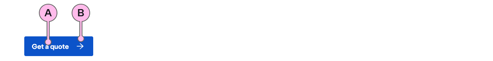
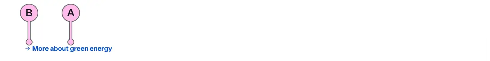
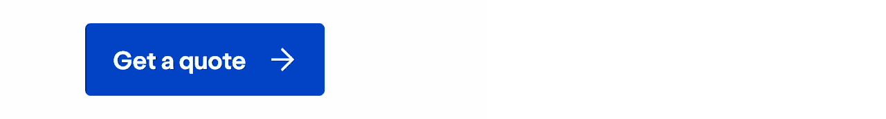

import { StorybookStory } from '../../includes/storybook-story.js'
import { ComponentPlacement } from '../../includes/component-placement.js'
import { PageFooter } from '../../includes/page-footer.js'

## Introduction

> A CTA (call-to-action) allows users to take action once they are ready for it.

Users can perform certain actions through the use of `ns-cta`. An example of these actions could be to submit a form through an event (i.e. click event) or navigate with a hyperlink.

There is no distinciton between a hyperlink or an action through the design of `ns-cta`. Use the text content to convey the intent of the CTA to the user.

## Content guidance

### CTA Direct

### CTA Text

| Key | Field type | Guidelines |
| :--- | :--- | :--- |
| A | Text | Keep the text 'short, relevant, and actionable'. It should not exceed more than 24 characters. |
| B | Icon | This is a decoration. It is intended to imply direction such as moving forwards and backwards in a journey. The [specification table](#specification) has a list of options. |

### Differences between `direct` and `text` types

The `direct` and `text` types of `ns-cta` are there to offer hierarchical structure to the page.

The `direct` type has a more emphasised affordance, therefore it can be used as the main action for that page. As it's the main action, it should be used sparingly.

The `text` type supports the `direct` type and helps build hierarchy. It can be used for actions that are not the main reason for the page and can accommodate longer text content.

For example, on the Energy Hub Page the main purpose is for customers to get a quote. This action would be a `direct` CTA supplementary information such as Seeing all tariffs, Energy guides or Learning about smart meters would be the `text` type. We recommend when grouping actions through a set of cards they all use the same CTA type.

#### How to identify when to use the `text` type

For example, if the content starts with:

- Learn more...
- Find out...
- Look up...
- See our...
- Discover...

These are all supporting actions and our recommendation is to use the `text` type.

If there is a group of more than three actions it would be preferable to make all these CTAs the `text` type. Or to find the main action in this group and place it in an alternative, more suitable component such as `ns-lockup` or `ns-standout` to establish hierarchy.

### When to use `submit` and `reset` types
The `submit` and `reset` types of `ns-cta` are there to facilitate the form component to do submit and reset actions respectively.

The `submit` type provides native-like submit action. It can be used in the page with form to do submit action. Upon submission which automatically validates the form elements and reports warning / submits the form.

The `reset` type provides native-like reset action. When wrapped in form component, `reset` type triggers reset action on all form element components enclosed within the form and reset them back to their default / initial value. 

### Button vs link

There is no visual distinction between a button and a link when using `ns-cta`. It's recommended not to use a native `<button>` element, but to use the CTA with the required events.

The distinction for a user on either a navigation or an event is not based on the appearance but on the text content. It needs to be clear based on the text content that the user is either going to the next step in a journey / page, or that they are doing an action, such as submitting a form.

### Decorative vs functional

The `ns-cta` is a standalone component that can serve an action whether it is a link or an event. However, if required it can be used as a decoration and be wrapped within an `<a>` element or another routing component (such as for specific frameworks). This means that those functionalities will still look like the `ns-cta` even though the functional task is being done outside of it.

## States

### Loading

The `ns-cta` is capable of handling a loading interaction using the `loading` and `loading-message` attributes, these can be found in the [specification table](#specification) below.

This loading state is used to provide the user with feedback that their action is being handled. It also reassures the user that action may take a number of seconds to be completed.

We recommend only to use this loading state for a maximum of 5 seconds. If it's known that the action is likely to take longer than 5 seconds, present the user with a [Roadblock page type](../page-types/roadblock).

If the action fails, don't leave the CTA in its Loading state. Present the user with clear feedback with [the highlighter component](../components/ns-highlighter).

Your loading message should be contextual to the action of the text of the CTA. E.g. "Get a quote" becomes "Getting your quote...". 

You can see the live example of the loading state on [Storybook](https://www.britishgas.co.uk/nucleus/demo/index.html?path=/story/ns-cta--direct-button-loading).

### Disabled

We do not offer a disabled state, every CTA should have an action even if that is to an unhappy path. Such as, when in a form, a submit CTA will go to the highest invalid inputter to help the user to complete the form. It allows us to track the experience better when the user can interact with it.

If we use a disabled state in this example, it will infuriate the user as they wouldn't know what their next action is. This may force them to take an undesirable action, such as trying to call the call centre.

The only time we present a disabled state is during the Loading state. This ensures no accidental additional clicks are performed whilst the action is in progress.

## Best practice

| 💚 Do's | 💔 Dont's |
| :--- | :--- |
| Make it short and actionable | Make it vague |
| Only use `loading` on an action that will take between 1 and 5 seconds | Make it overly wordy |
| Relate the action to the content it sits beside | Change the icon for the sake of it |
| Use `direct` type for the most important action on the page | Use more than 24 characters |
| Use `text` type to support the direct action | Have CTAs within a paragraph |
| Use instead of a native button | Repeat the CTA copy within the same page |
| Use `submit` type in a form for form submission | Use for downloads. Use the [`ns-download` component](../components/ns-download) instead |
| Use `reset` type in a form for form reset action | |

### Considerations of best practice

* It should always be clear to the user what the CTA's action is through its text.
* To be aware of the distinct roles of the CTA's types `direct` and `text` and that they don't always act as a `primary` and `secondary` button.
* Try not to have multiple CTA's next to each other.
* Don't make the main purpose of the page to have a group of CTAs.
* Don't overload the page with the same type of CTA or too many CTAs.
* The `loading` message should be the action of the text of the CTA. E.g. "Get a quote" becomes "Getting your quote...".

## Usage

<StorybookStory story="components-ns-cta--direct-link"></StorybookStory>

## Component placement

<ComponentPlacement component="ns-cta" parentComponents="ns-landmark,ns-lockup,ns-card,ns-product-card,ns-form,ns-fieldset,ns-content,ns-highlighter"></ComponentPlacement>

## Specification

| Attribute | Property | Type | Default | Options | Description |
| :--- | :--- | :--- | :--- | :--- | :--- |
| `type` | `type` |`string` | `direct` | `direct`, `text`, `submit`, `reset` | Different variants of the CTA. |
| `href` | `href` | `string` |  |  | Navigating using a hyperlink. |
| `icon` | `icon` | `string` | `arrow-right` | `arrow-left`, `arrow-right` See [`ns-icon` component](../components/ns-icon) | The icon inside the CTA. |
| `loading` | `loading` | `string` | `false` | `true`, `false` | Change the state of the CTA to loading. |
| `loading-message` | `loadingMessage` | `string` | `Loading...` |  | Overwrites the CTA anonymous slot for the loading state. |

| Slots | Type |
| :--- | :--- |
| Anonymous | textNode |

## Specification notes

### Icons

* They are decorative, not descriptive, and are there to supplement the text.

### Href

* Can be used instead of having a wrapping `<a>` element.
* This shouldn't be used if a `click` event is added.

## Feedback

* Do you have insights or concerns to share? You can raise an issue via [Github bugs](https://github.com/ConnectedHomes/nucleus/issues/new?assignees=&labels=Bug&template=a--bug-report.md&title=[bug]%2[ns-cta]).
* See all the issues already raised via [Github issues](https://github.com/connectedHomes/nucleus/issues?utf8=%E2%9C%93&q=is%3Aopen+is%3Aissue+label%3ABug+[ns-cta]).

<PageFooter></PageFooter>

## Related links

* [CTA examples in the homepage](https://britishgas.co.uk/nucleus/demo/index.html?path=/story/examples-homepage--2019-01).
