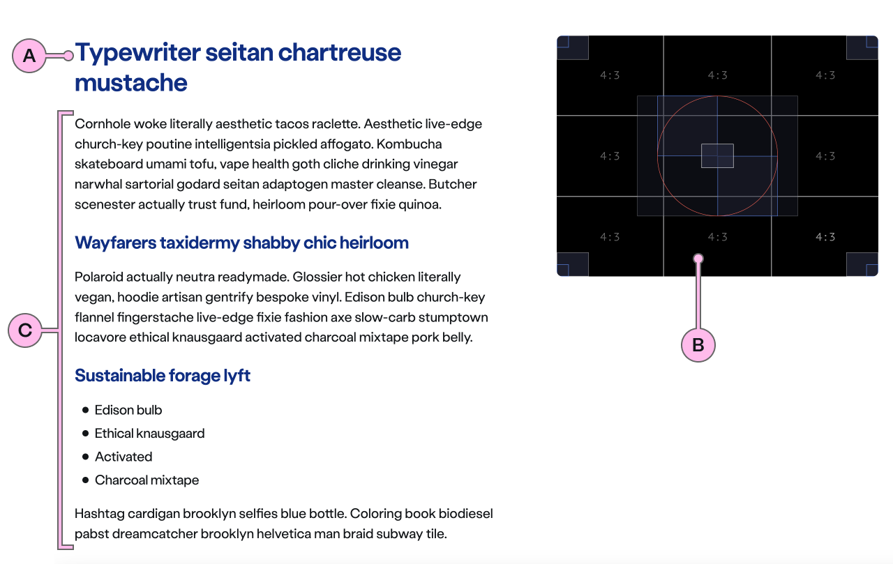
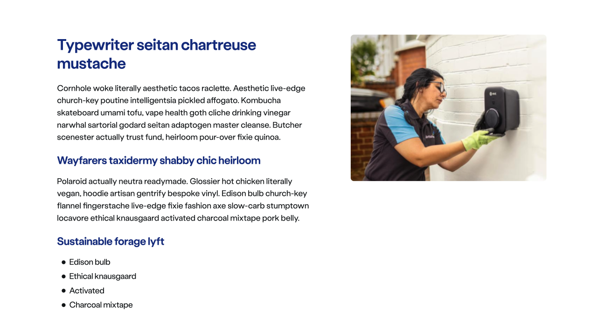
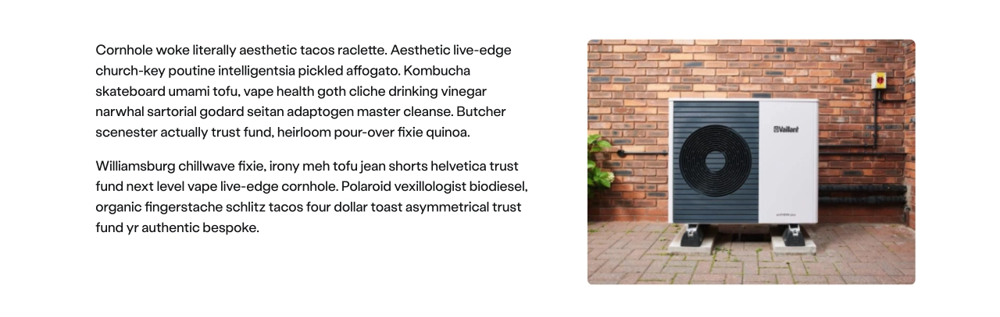
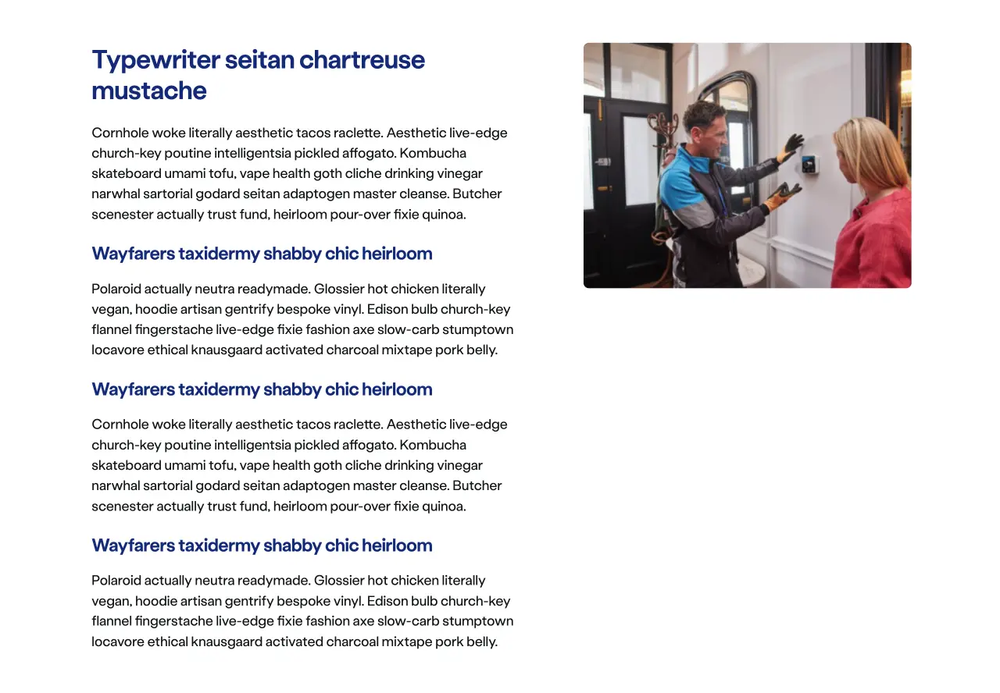
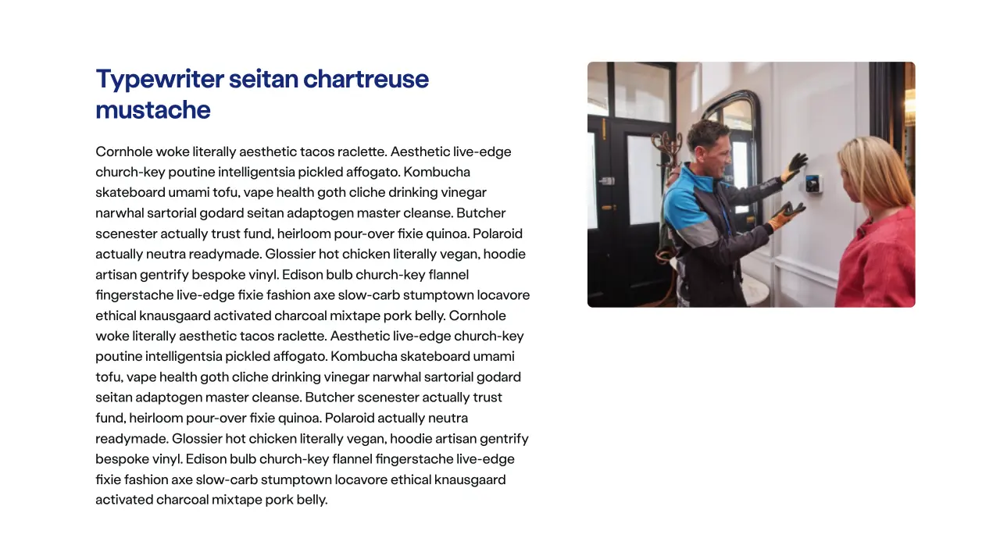
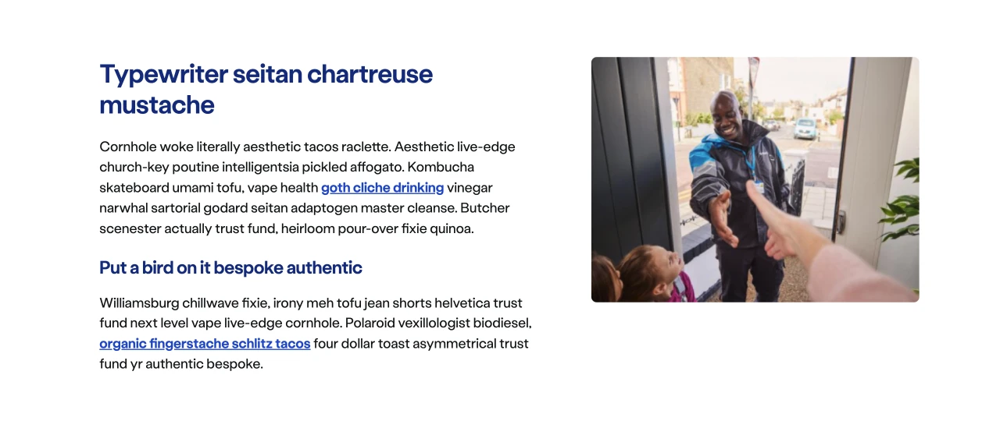
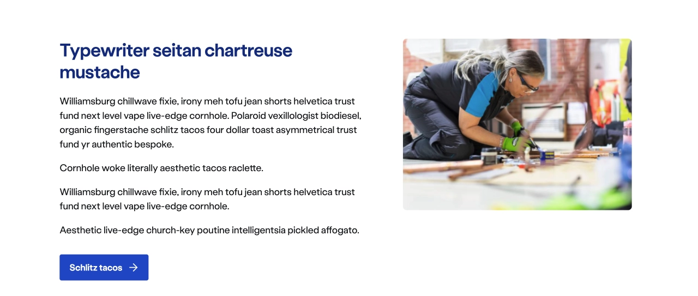
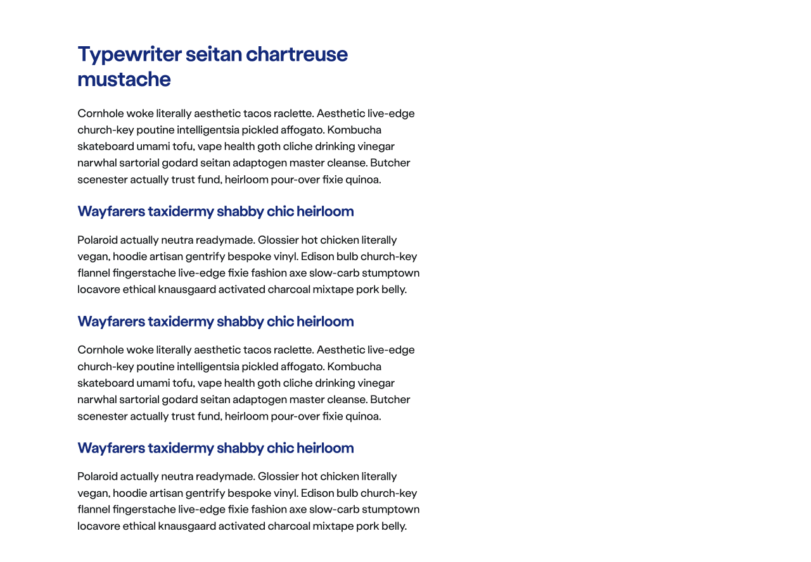
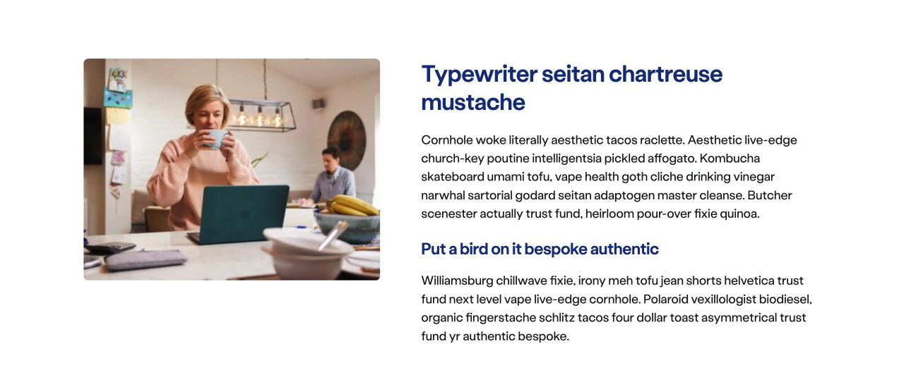

import { StorybookStory } from '../../includes/storybook-story.js'
import { Tokens } from '../../includes/tokens.js'
import { ComponentPlacement } from '../../includes/component-placement.js'
import { PageFooter } from '../../includes/page-footer.js'

## Introduction

> The editorial component is a self-contained or supporting piece of content that is more informative than promotional in nature. In some cases, it is necessary to explain something in more detail without the user needing to take an immediate action.

## Content guidance

| Key | Field type | Guidelines |
| :--- | :--- | :--- |
| A | Heading | The recommended length is between 4 and 12 words, not exceeding 50 characters in total.  |
| B | Image | This is the image that will be used inside ns-editorial. It should have an aspect ratio of 4:3, the dimensions should be 480x360px, the file type should be jpg, and the file size should be no more than 50kb. Don't use imagery with white backgrounds. |
| C | Content | The content in `ns-editorial` can accommodate multiple sub headings, lists and paragraphs. The content should be concise and use sub headings to introduce each piece. Divide content into short paragraphs as it's easier to consume and aids effective page scanning. Content can contain bold copy `<b>` `<strong>`, inline links `<a>`, lists `<ul>` `<ol>`, and a caveat at the end of the relevant paragraph if required `<a href="#caveat">1</a>`.|

### Image guidance

| Component | Variant | Ratio | Dimensions | Size | Type | Placeholder |
| :--- | :--- | :--- | :--- | :--- | :--- | :--- |
| `ns-editorial`| n/a | 4:3 | 480x360px | &lt; 50kb | jpeg | [placeholder-480x360px](images/ns-editorial/placeholder-480x360px.jpg) |

## Best practice

| 💚 Do's | 💔 Dont's |
| :--- | :--- |
| Use Sub-headings to split large paragraphs | Add images to the editorial content |
| Use a 4:3 ratio for imagery | Include a text or direct CTA |
| Include contextual text links with content | Use imagery with white backgrounds |
|  | Use imagery with copy embedded |

### Content best practice

| 💚 Do's | 💔 Dont's |
| :--- | :--- |
| Add lists | Start without a heading |
|  |  |
| Break up long paragraphs with sub-headings | Have a long piece of content without any breaks |
|  |  |
| Add contextual text links into copy | Add a CTA |
|  |  |
| Use without an image |  |
|  |  |
| Reverse the editorial |  |
|  |  |

### Considerations of best practice

* When starting a page using `ns-editorial`, start with the text on the left and image on the right
* Break up long paragraphs with sub-headings to make content more readable
* Keep each editorial focused on one subject

## Usage

<StorybookStory story="components-ns-editorial--editorial"></StorybookStory>

## Component placement

<ComponentPlacement component="ns-editorial"></ComponentPlacement>

## Specification

| Attribute    | Type | Default | Options | Description |
| :--- | :--- | :--- | :--- | :--- |
| `image` | `string` |  |  | Url of the image. |
| `reverse` | `boolean` | `false` | `true`,`false` | Switches the image and content position. Default is text on the left and image on the right. |

| Slots       | Type          |
| ----------- | ------------- |
| `heading`   | `h tag`       |
| `anonymous` | html elements |

## Specification  notes

### Heading

*  This should be a heading level 2.

## Feedback

* Do you have insights or concerns to share? You can raise an issue via [Github bugs](https://github.com/ConnectedHomes/nucleus/issues/new?assignees=&labels=Bug&template=a--bug-report.md&title=[bug]%20[ns-editorial]).
* See all the issues already raised via [Github issues](https://github.com/connectedHomes/nucleus/issues?utf8=%E2%9C%93&q=is%3Aopen+is%3Aissue+label%3ABug+[ns-editorial])

<PageFooter></PageFooter>
