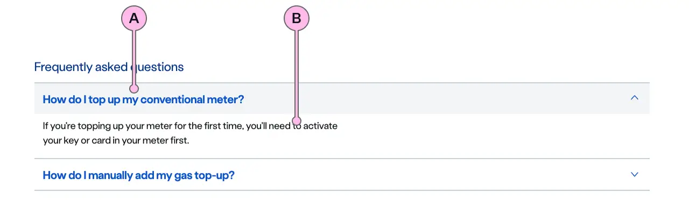

import { StorybookStory } from '../../includes/storybook-story.js'
import { Tokens } from '../../includes/tokens.js'
import { ComponentPlacement } from '../../includes/component-placement.js'
import { PageFooter } from '../../includes/page-footer.js'

## Introduction

> Expanders are used to show or hide content.

An expander consists of a heading and an anonymous content slot.  When the heading is clicked the component opens to reveal the content. When in an open state, clicking the heading will hide the content. 

Expanders can be used in [a variety of contexts](#component-placement): in an accordion, in a product  card, and more. 

## Content guidance
In the following examples, the expander is used in an accordion and in a selector.

| Key | Field type | Guidelines |
| :--- | :--- | :--- |
| A | Heading | The heading is there to introduce the content placed in the expander's anonymous slot. When the heading is clicked the component opens to reveal the content.   |
| B | Content | The expander can accommodate multiple paragraphs. These should be concise, using sub-headings to split large paragraphs. It can contain bold copy `<b>`, inline links `<a>`, and lists `<ul>` `<ol>`. We recommend to use `ns-content` as a container for the html content.|

## Best practice

| 💚 Do's | 💔 Don'ts |
| :--- | :--- |
| Use instead of modal | Use to hide important information |
| Use headings, paragraphs, lists for content | Use as a solution to excessive copy on a page |
| Make sure the heading in the heading slot relates to content | Nest expanders within expanders |
| Use a coloured expander to draw attention to a promotion in an expander on a product card | Use multiple coloured expanders on one page|
|  | Use a coloured expander to draw attention to a warning message. Use [ns-highlighter](components/ns-highlighter.md) or [ns-skyline](components/ns-skyline.md) instead. |

### Considerations of best practice

- If you are using the expander in a series of [product cards](components/ns-product-card.md) and you have a promotion, you can use multiple expanders on the same page to provide additional information on that promotion.
- You can put any media inside the expanders, but be wary of the size of said media and how it will render.
- When using multiple expanders without an accordion, consider adding a heading to introduce them. If you don't, the nearest higher-level heading preceding the expanders will be the one setting the theme. 

## Usage

<StorybookStory story="components-ns-expander--expander"></StorybookStory>

## Component placement

We recommend expanders to be primarily used in `ns-accordion` and `ns-skyline`.

<ComponentPlacement component="ns-expander" parentComponents="ns-accordion,ns-skyline,ns-card,ns-content,ns-product-card,ns-selector"></ComponentPlacement>

## Specification

| Attribute | Type | Default   | Options   | Description |
| :--- | :--- | :--- | :--- | :--- |
| `type` | `string` | `standard` | `skyline`, `standard` | Variants for the expander. |
| `open` | `string` | `false` | `true`, `false` | If true will open the expander to show the content. |
| `icon` | `string` |  | `info`, `warning`. See [`ns-icon` component](../components/ns-icon) | Only use for a `type` of `skyline` |
| `colour` | `string` |  | `yellow` | Sets the colour for the heading - Only use for a `type` of `standard` |

| Slots | Type |
| :--- | :--- |
| `heading` | `h tag`      |
| anonymous | `ns-content` or html content  |

| Event | Description |
| :--- | :--- |
| `expander-toggle` | Will be dispatched when expander is clicked to show/hide. |

## Feedback

* Do you have insights or concerns to share? You can raise an issue via [Github bugs](https://github.com/ConnectedHomes/nucleus/issues/new?assignees=&labels=Bug&template=a--bug-report.md&title=[bug]%20[ns-expander]).
* See all the issues already raised via [Github issues](https://github.com/connectedHomes/nucleus/issues?utf8=%E2%9C%93&q=is%3Aopen+is%3Aissue+label%3ABug+[ns-expander]).

<PageFooter></PageFooter>

## Related links

* [ns-accordion](components/ns-accordion.md)
* [ns-skyline](components/ns-skyline.md)
