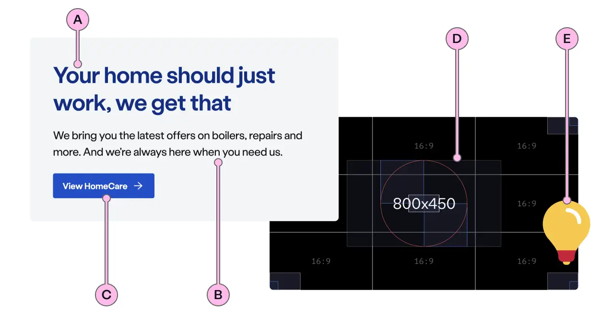
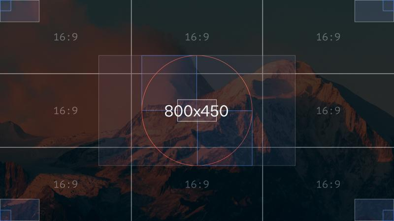
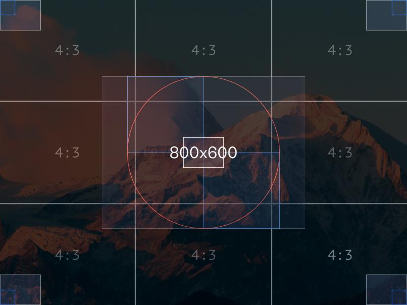
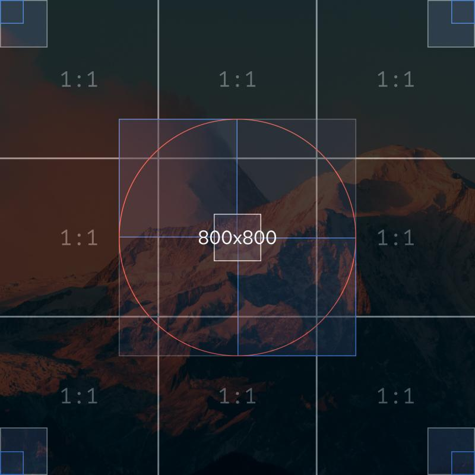
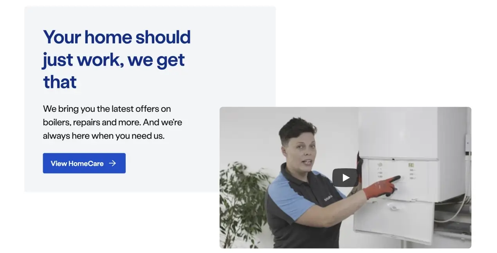

import { StorybookStory } from '../../includes/storybook-story.js'
import { ComponentPlacement } from '../../includes/component-placement.js'
import { PageFooter } from '../../includes/page-footer.js'

## Introduction

> Lockups are a promotional component that signpost to a product or service, highlighting key messages.

We use lockups to engage customers, in particular to promote a key product or service. The more relevant and contextual the content is for intended customers, the better.

## Content guidance

| Key | Field type | Guidelines |
| :--- | :--- | :--- |
| A | Sub-heading | Sub-headings are used to indicate the primary section or to reinforce a brand message. Short and simple words tend to work better and it is recommended to keep the length between 1 and 5 words. Include a full stop at the end of the sub-heading. |
| B | Heading | The recommended length is between 4 and 12 words, not exceeding 50 characters in total. Headings contain light and bold font weight to highlight key messaging.  |
| C | Content | `ns-lockup` can accommodate multiple paragraph slots. However, be mindful of keeping it concise. Our guidance is a maximum of 2 short paragraphs, each with no more than 3 lines each. Can contain bold copy `<b>`, inline links `<a>`,  lists `<ul>` `<ol>`, and a caveat at the end of the relevant paragraph if required `<a href="#caveat">1</a>`. |
| D | CTA | Keep the text ‘short, relevant, and actionable’. It should not exceed more than 24 characters. |
| E | Image | There is a choice between 3 image sizes - the first has an aspect ratio of 16:9, the dimensions should be 800 x 450px, the second has an aspect ratio of 4:3, the dimensions should be 800 x 600px, and the third has an aspect ratio of 1:1, the dimensions should be 800 x 800px. Both versions should be jpg file types, and the file size should be no more than 100kb. To see which image you can use - please see the [Image guidance section](#image-guidance) below. Don't use imagery with white backgrounds. Please make sure you work with a designer when selecting any imagery for the `ns-lockup`. |
| F | Decoration | Use this optional illustration to support and highlight the content. The illustration should relate to the product or service you are talking about. The [specification table](#specification) has a list of options. |

### Image guidance

| Preview | Ratio | Dimensions | Size | Type | Placeholder |
| :--- | :--- | :--- | :--- | :--- | :--- |
|  | 16:9 | 800 x 450px | &lt;100kb | .jpg | [ns-lockup-image-800x540-ratio16_9](images/ns-lockup/ns-lockup-image-800x540-ratio16_9.jpg) |
|  | 4:3 | 800 x 600px | &lt;100kb | .jpg | [ns-lockup-image-800x600-ratio4_3](images/ns-lockup/ns-lockup-image-800x600-ratio4_3.jpg) |
|  | 1:1 | 800 x 800px | &lt;100kb | .jpg | [ns-lockup-image-800x800-ratio1_1](images/ns-lockup/ns-lockup-image-800x800-ratio1_1.jpg) |

## Best practice

| 💚 Do's | 💔 Don'ts |
| :--- | :--- |
| Use the key message in the heading | Include more than one CTA |
| Keep the heading length to 4-12 words | Exceed more than two paragraphs of 3 lines each |
| Keep sub-heading length between 1-5 words | Use images with a white background |
| Optimise the lockup image (see [Optimise your images](https://nucleus.design/docs/foundations/photography#optimise-your-images)) | Use images that have any important part obscured by the overlap |

### Considerations of best practices

* Alternate the position of image/video when using more than one lockup.
* Paragraph works best as a single, short paragraph.
* Use real-life photographs.

## Usage

<StorybookStory story="components-ns-lockup--lockbox"></StorybookStory>

## Component placement

<ComponentPlacement component="ns-lockup" parentComponents="ns-panel"></ComponentPlacement>

## Specification

| Attribute    | Type                | Default   | Options   | Description |
| :--- | :--- | :--- | :--- | :--- |
| `type` | `string` | `lockbox` | `lockjaw`, `lockbox`, `locknut` | At present, these three styles share identical visual and functional features; however, there is a possibility that they will diverge in the future. |
| `reverse` | `boolean` | `false` |`true`, `false`| Switches the order of the text and image. Default (`false`) is text to the left. |
| `ratio` | `string` | `4x3` | `4:3`, `16:9`, `1:1` | Ratio for the image. |
| `decoration` | `string` |  | See [ns-illustration component in Storybook](https://britishgas.co.uk/nucleus/demo/index.html?path=/story/ns-illustration--standard) | Adds an illustration overlapping the image. |

| Slots | Type |
| :--- | :--- |
| `heading` | `h2 tag`                             |
| `paragraph` | `
`, `<a>`, `<ul>`, `<ol>`, `<li>` |
| `cta` | `ns-cta` |
| `image` | `ns-image` `ns-video` |

## Specification notes

### Heading

* Should be a `h2` tag.
* The sub-heading is part of the heading to allow screen readers to read the heading properly.
* Sub-heading is a `` tag with a `h5` class.
* Main heading is a `` tag with a `h1` class.

### Video

* Use the `video` variant when using a video instead of an image as the overlap is in front of the text box so neither the video nor its captions are obscured. The text then wraps around the video edge. (See the `video` example on [Storybook](https://www.britishgas.co.uk/nucleus/demo/index.html?path=/story/components-ns-lockup--video))
* It is not possible to use an illustration decoration with a video.
* Use the video's YouTube link as the `id` attribute's value.

## Feedback

* Do you have insights or concerns to share? You can raise an issue via [Github bugs](https://github.com/ConnectedHomes/nucleus/issues/new?assignees=&labels=Bug&template=a--bug-report.md&title=[bug]%20[ns-lockup]).
* See all the issues already raised via [Github issues](https://github.com/connectedHomes/nucleus/issues?utf8=%E2%9C%93&q=is%3Aopen+is%3Aissue+label%3ABug+ns-lockup).

<PageFooter></PageFooter>
