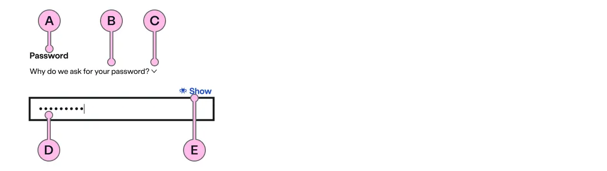
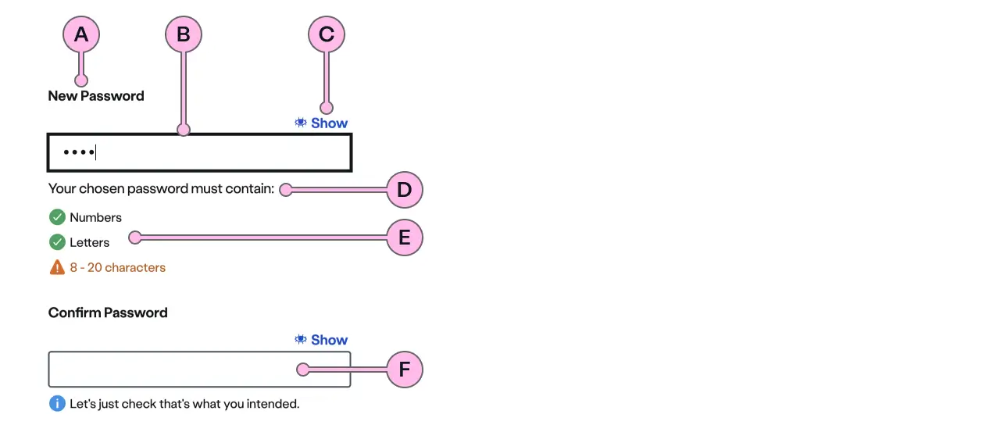
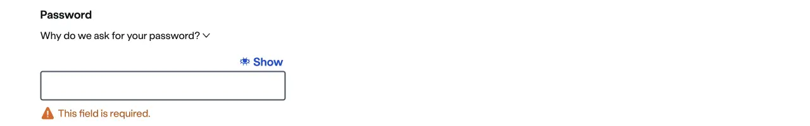

import { StorybookStory } from '../../includes/storybook-story.js'
import { ComponentPlacement } from '../../includes/component-placement.js'
import { PageFooter } from '../../includes/page-footer.js'

## Introduction

> A standardised Password component that supports users when entering an existing password.

The ns-password component has been developed to include a set of features that help a user not only enter a password but can accommodate their need to create one too.

This component wraps our ns-inputter component. Guidelines defined on the ns-inputter should also be considered when using this component. See [ns-inputter](components/ns-inputter.md) documentation.

## Content guidance

### Variants and purpose

There are 2 variants of the ns-password component. Each should be used for its specific purpose. Both accommodate password manager applications, display at an appropriate width for the number of characters required, can have optional helper text, and use mono-spaced alignment for legibility.

#### Standard

Use this variant when a user needs to enter a password they have already created to access secure information. It comprises a label, an input field with masking as default, a show/hide toggle and validation.

| Key | Field type | Guidelines
| :--- | :--- | :--- |
| A | Label | Leave this to say 'Password' to clearly define the purpose. |
| B | Helper | Optional helpful messaging can be used. |
| C | Tip | Optional explanatory information. |
| D | Input | By default the input is masked. |
| E | Show/Hide | Toggle to reveal or hide the password. |

#### Confirm Password

This variant is more complex than the Standard one. It allows a user to correctly format a new password and validate it against certain criteria. It comprises the same label, optional helper and tip text, input field and show/hide toggle as the standard version but includes a more proactive and helpful in-line validation technique as well as a Confirm Password field to verify the user is entering what they intended.

| Key | Field type | Guidelines
| :--- | :--- | :--- |
| A | Label | Leave this to say 'Password' to clearly define the purpose. |
| B | Input | By default the input is masked. |
| C | Show/Hide | The show/hide toggles are dependent on each other to make comparison easy. |
| D | Validation message | Dynamic messaging to help the user correctly format when creating their new password. |
| E | In-line validation | Instantly updates as the user creates their password. |
| F | Confirmation | Checks the user has entered the password they intended by matching them. |

### Validation
The Confirm Password variant has in-line validation that checks the input as the user types. This helps provide useful instant feedback to them on their formatting. The requirements can be flexible but currently set as British Gas format by default. The requirements are also accompanied by helpful messaging that changes with the status. 

| Icon | Description |
| :--- | :--- |
|  | Information icon. This informs the user as to what is required before any input has been made. |
|  | Warning triangle. This requirement has not yet been made. Text will also turn red. |
|  | Success tick. This particular requirement has been met. |

Once all requirements have been met the input field's border also thickens changes to green to emphasise this. 

The Standard variant just uses a single validation requirement that appears if the user tries to proceed without entering a password.

## Best practice

| 💚 Do's | 💔 Don'ts |
| :--- | :--- |
| Use the correct variant for its intended purpose | Try to make up another version by using parts - it will lead to an inconsistent experience |
| Ensure the requirements reflect what's needed | Use requirements that differ from company policy |
| Add Helper text or tips if necessary |  |

## Usage

<StorybookStory story="form-components-ns-password--standard"></StorybookStory>

## Component placement

<ComponentPlacement component="ns-password" parentComponents="ns-form,ns-form-group"></ComponentPlacement>

## Specification

Also see ns-inputter [specification](components/ns-inputter.md#specification)

| Attribute | Type | Default | Options | Description |
| :--- | :--- | :--- | :--- | :--- |
| `type` |  `string`  | `default` | [`default`, `confirm`] | The type of the password component. Use `default` type for login journey and `confirm` type for registration journey. |
| `value`   | `string` | `''` |  | The value of the input or group of inputs inside `ns-inputter`. This can be used to add an initial value. |
| `helper` | `string` |  |  | See [ns-inputter](components/ns-inputter.md#specification). |
| `tip` | `string` |  |  | See [ns-inputter](components/ns-inputter.md#specification). |
| `name` | `string` | `password` |  | See [ns-inputter](components/ns-inputter.md#specification). |
| `passwordValidation` | `array` | `['hasNumbers', 'hasLetters', 'isBetween(8, 20)']` | |  Assists a user when adding a valid password and shows an error message when they're not. See [ns-inputter](components/ns-inputter.md#validation)
| `label` |  `string`  | `Password` |  | The value of the label for password field. |
| `confirmLabel` |  `string`  | `Confirm Password` |  | The value of the label for confirm password field. This attribute is used along with `confirm` type. |

## Feedback

* Do you have insights or concerns to share? You can raise an issue via [Github bugs](https://github.com/ConnectedHomes/nucleus/issues/new?assignees=&labels=Bug&template=a--bug-report.md&title=[bug]%20[ns-password]).
* See all the issues already raised via [Github issues](https://github.com/connectedHomes/nucleus/issues?utf8=%E2%9C%93&q=is%3Aopen+is%3Aissue+label%3ABug+[ns-password]).

<PageFooter></PageFooter>

## Related links

* [ns-inputter](components/ns-inputter.md)
* [ns-form](components/ns-form.md)
* [ns-form-group](components/ns-form-group.md)
