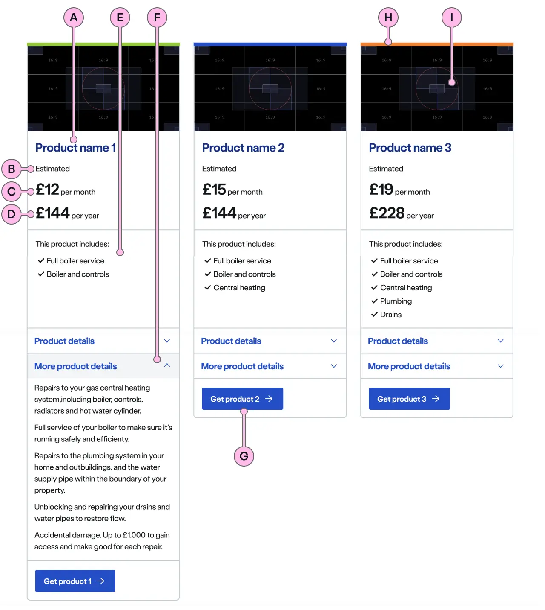
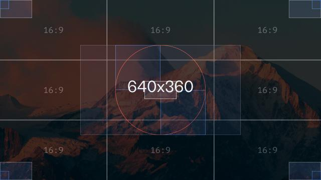
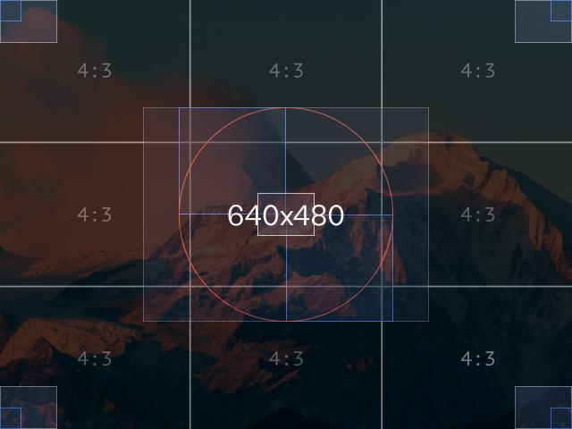
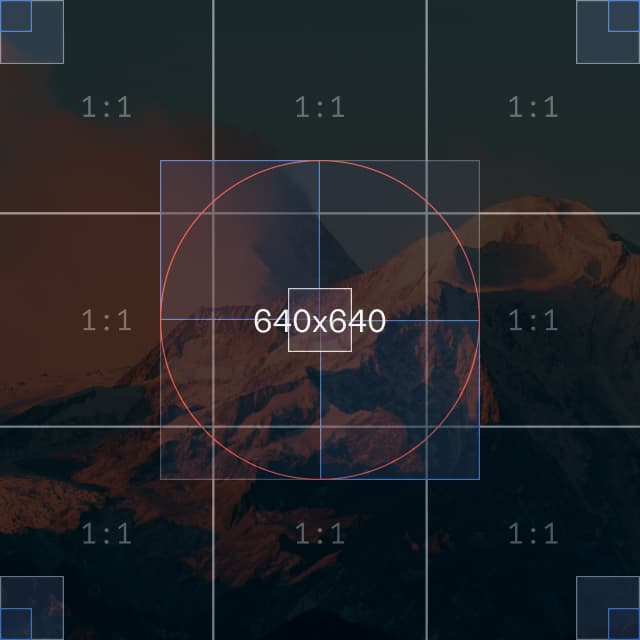

import { StorybookStory } from '../../includes/storybook-story.js'
import { Tokens } from '../../includes/tokens.js'
import { ComponentPlacement } from '../../includes/component-placement.js'
import { PageFooter } from '../../includes/page-footer.js'

## Introduction

> The product card enables users to browse, compare and choose a product.

## Content guidance



| Key | Field type | Guidelines |
| :--- | :--- | :--- |
| A | Product name | The product name should be brief and memorable, ideally 2 to 3 words (10 to 15 characters). Maximum 25 characters. |
| B | Price subtitle | This should be used to give context to your product price. 15 to 23 characters maximum. |
| C | Primary price | The is the leading product price. This is optional as a product price may not always be available. |
| D | Secondary price | This is the secondary product price. This is also optional.|
| E | Product description | The product description can accommodate multiple sub headings, lists and paragraphs. The content should be concise and use bulleted or checked lists to support skim reading. Comparable product features should be repeated in the same list order across all products. Content can contain bold copy `<b>` `<strong>`, inline links `<a>`, lists `<ul>` `<ol>`, and caveats if required `<a href="#caveat">Caveat</a>`. |
| F | Expander | Expanders can be used to provide additional product detail. Each product should have a maximum of 3 expanders. |
| G | Call to action | Keep the text ‘short, relevant, and actionable’. It should not exceed more than 10 characters. |
| H | Keyline | An optional colour keyline can be added to distinguish and draw attention to your products. |
| I | Image | An optional image with an aspect ratio of 16:9 (default), 4:3 or 1:1 can be added to support your product description. |
### Image guidance

| Preview | Ratio | Dimensions | Size | Type | Placeholder |
| :--- | :--- | :--- | :--- | :--- | :--- |
|  | 16:9 | 640 x 360px | &lt;50kb | jpeg | [ns-product-card-640x360px](images/ns-product-card/ns-product-card-image-640x360-ratio16_9.jpg) |
|  | 4:3 | 640 x 480px | &lt;50kb | jpeg | [ns-product-card-640x480px](images/ns-product-card/ns-product-card-image-640x480-ratio4_3.jpg) |
|  | 1:1 | 640 x 640px | &lt;50kb | jpeg | [ns-product-card-640x640px](images/ns-product-card/ns-product-card-image-640x640-ratio4_3.jpg) |

## Best practice

| 💚 Do's | 💔 Don'ts |
| :---  | :---  |
| Use for products | Use for other content types, use ns-card instead |
| Use the same sections for all products in a group | Use in a form |
| Give multiple cards the same html parent | Use different ratio images across a set of multiple cards |
| Use `role="list"` and `role="listitem"` when used in multiples | Overuse the keyline - its purpose is to make that card stand out from others |

### Considerations of best practises

Give multiple cards the same html parent. To improve scannability between multiple products; the name, price, and description sections will adjust to be the same height. They do this using a common html parent that's used to share css variables.

For example

💚 Do

```markup
<div role="list">
  <ns-product-card role="listitem">...</ns-product-card>
  <ns-product-card role="listitem">...</ns-product-card>
  <ns-product-card role="listitem">...</ns-product-card>
</div>
```

💔 Don't

```markup
<div role="list">
  <div role="listitem">
    <ns-product-card >...</ns-product-card>
  </div>
  <div role="listitem">
    <ns-product-card >...</ns-product-card>
  </div>
  <div role="listitem">
    <ns-product-card >...</ns-product-card>
  </div>
</div>
```

## Usage

<StorybookStory story="components-ns-product-card--single"></StorybookStory>

## Component placement

<ComponentPlacement component="ns-product-card" parentComponents="ns-column"></ComponentPlacement>

## Specification

| Attribute | Type | Default | Options | Description |
| :--- | :--- | :--- | :--- |-------------|
| `keyline` | `string` | none | `cyan`, `lime`, `navy`, `blue`, `forest`, `slate`, `orange`, `red`, `yellow` | Add a colour across the top of the card |

| Slots | Type |
| :--- | :--- |
| `image` | `<ns-image>` |
| `highlight` | `<p>` |
| `name` | `<h2>`, `<h3>` |
| `price-heading` | `<h3>`, `<h4>` |
| `price` | `<div>` |
| `description` | `<div>` |
| `expander` | `<ns-expander>` |
| `cta` | `<ns-cta >` |

## Specification notes

### `image`

* Check the [ns-image documentation](components/ns-image.md) for more information.

### `name` and `price-heading`

* priceHeading should be one heading level lower than name

### `price`

* Use multiple `<p>` containing `<ns-price>`
* Check the [ns-price documentation](components/ns-price.md) for more information.

### `description`

* Div should only contain `<p>`, `<ul>`, `<ol>`

### `expander`

* Multiple expanders may be used
* Check the [ns-expander documentation](components/ns-expander.md) for more information.

### `cta`

* Should always have a href
* Check the [ns-cta documentation](components/ns-image.md) for more information.

<Tokens component="product-card"></Tokens>

## Feedback

* Do you have insights or concerns to share? You can raise an issue via [Github bugs](https://github.com/ConnectedHomes/nucleus/issues/new?assignees=&labels=Bug&template=a--bug-report.md&title=[bug]%20[ns-product-card]).
* See all the issues already raised via [Github issues](https://github.com/connectedHomes/nucleus/issues?utf8=%E2%9C%93&q=is%3Aopen+is%3Aissue+label%3ABug+[ns-product-card]).

<PageFooter></PageFooter>
