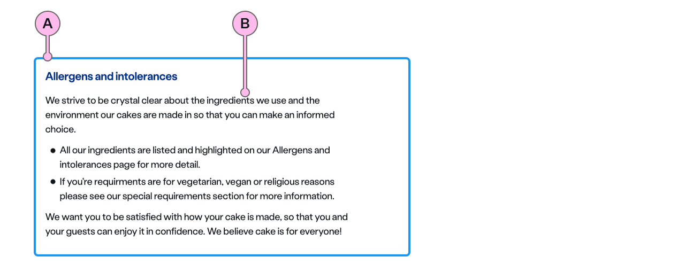

import { StorybookStory } from '../../includes/storybook-story.js'
import { ComponentPlacement } from '../../includes/component-placement.js'
import { PageFooter } from '../../includes/page-footer.js'

## Introduction

> The `ns-standout` component's purpose is to draw attention to important information that the user will need to know.

Use the `ns-standout` component to make information stand out from a page and to visually differentiate a concise block of text from the content that surrounds it, for example:

* Quotes (as in prices)
* Call-outs
* Examples
* Additional information about the page
* Emergency information

## Accessibility

The component is not announced to screen readers upfront, to help differentiate it from [ns-alert](../components/ns-alert) messages. It will be read in the order it comes in the document. You can choose from different coloured borders, but the text and background retain the standard colours, therefore, meeting suitable contrast ratios.

## Content guidance

| Key | Field type | Guidelines |
| :--- | :--- | :--- |
| A | Decoration | You can choose to change the border colour from the default cyan to any of the colour options defined in the specifications. |
| B | Content | You can populate the content using HTML, such as headings, paragraphs, lists, and text links as required. |

## Best practice

| 💚 Do's | 💔 Don'ts |
| :--- | :--- |
| Keep concise and to the point |  Fill with many paragraphs |
| Limit use to 1 or 2 per page |  Overuse it everywhere - it dilutes the impact |
| Use it to make information stand out |  Use it in place of ns-alert or ns-card – they have a different purpose |
| Select a colour border decoration that works with your design | Add icons, images or illustrations | 
| Use a relevant, single text link if it is necessary | Use the direct ns-cta (you should consider using ns-card instead for that purpose) |
| Use without an h2-h6 | Nest another ns-standout component within it |
| Use without a link | Use in a form where helper text is more appropriate |
| Ensure the information is relevant and important enough to stand out from the rest of the content | Use for warning or error messages |

## Usage

<StorybookStory story="components-ns-standout--subtle"></StorybookStory>

## Component placement

<ComponentPlacement component="ns-standout" parentComponents="ns-column,ns-content,ns-editorial,ns-form"></ComponentPlacement>

## Specification

| Attribute | Property | Type | Default | Options | Description |
| :--- | :--- | :--- | :--- | :--- | :--- |
| `decoration` | `decoration` | `string`  | `cyan` | `cyan`, `lime`, `navy`, `blue`, `forest`, `slate`, `orange`, `red`, `yellow` | Colour of border |

| Slots | Type |
| :--- | :--- |
| anonymous | `ns-content`, `ns-column` |

## Specification notes

### Anonymous

* Can only accept a single ns-content

## Feedback

* Do you have insights or concerns to share? You can raise an issue via [Github bugs](https://github.com/ConnectedHomes/nucleus/issues/new?assignees=&labels=Bug&template=a--bug-report.md&title=[bug]%20[ns-standout]).
* See all the issues already raised via [Github issues](https://github.com/connectedHomes/nucleus/issues?utf8=%E2%9C%93&q=is%3Aopen+is%3Aissue+label%3ABug+[ns-standout])

<PageFooter></PageFooter>
