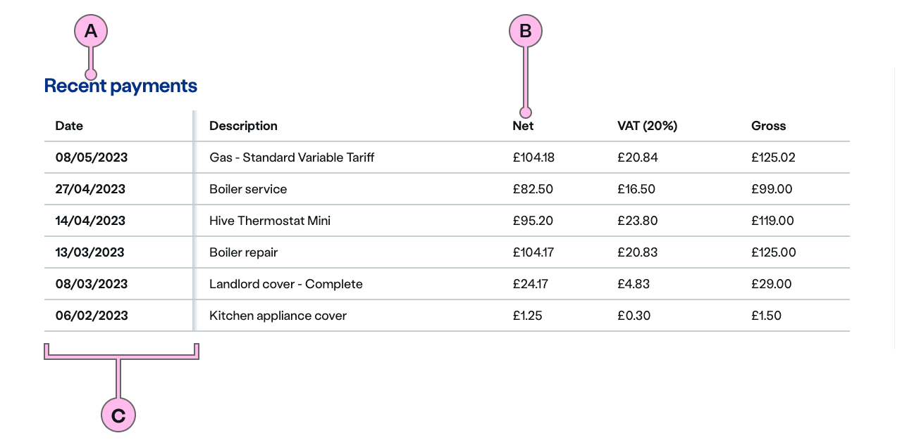

import { StorybookStory } from '../../includes/storybook-story.js'
import { Tokens } from '../../includes/tokens.js'
import { ComponentPlacement } from '../../includes/component-placement.js'
import { PageFooter } from '../../includes/page-footer.js'

## Introduction

> The `ns-table` component displays information in a grid-like format of rows and columns. It organises information in a way that’s easy to scan, so that users can look for patterns and insights.

The table component consumes basic HTML table markup, which makes it accessible and responsive as well as styling it.

## Content guidance



| Key | Field type | Guidelines |
| :--- | :--- | :--- |
| A | Heading | Use to provide context to the table content. The recommended length is between 4 and 12 words, not exceeding 50 characters in total. |
| B | Column Headings | A short description of the data or information found in the column cells below. |
| C | Fixable Row Headings | This column can be used for data or information. It can also be set to a fixed column of headings for each row. |
| D | Table Cells | This should contain the data or information required for each relevant column and row. |

## Best practice

| 💚 Do's | 💔 Don'ts |
| :--- | :--- |
| Add a `<caption>` to the `ns-table` | Use ns-table just for layout |
| Use for displaying data in tables | Use for laying out components |
| Use basic text, numbers | Use tables for anything but tabular data |
| Include at least one column header or row header | |
| Keep column and row headers short and concise | |
| Structure them in a logical and expected way | |


### Considerations of best practice

* Not all tables necessarily need captions, but it's recommended you provide one.
* Column header names should describe the type of content displayed in each column. Each row should contain data related to a single entity.
* Think about the experience on a smaller screen size.
* The `ns-table` component adds all the necessary Aria tags to the table to make it accessible for screen readers.
* Keyboard controls are automatically added to the table to make it perform as a data grid.  You can select cells and use the arrow keys to navigate.
* If your table has table headers `<th>` in the first column, the component will make these “sticky” so that the table data can be scrolled horizontally whilst the first column headers stay in place.

## Usage

<StorybookStory story="components-ns-table--data-table"></StorybookStory>

## Component placement

<ComponentPlacement component="ns-table" parentComponents="ns-panel,ns-content,ns-tab"></ComponentPlacement>

## Specification

`ns-table` doesn't expect any attributes to be added to it, you simply need to insert HTML table markup and it will render the table in an accessible and responsive way.

### Caption

Be sure to add a `<caption>` tag inside the `<table>`.  The caption should explain what the table is representing.

```html
<table>
  <caption>European countries in order of population</caption>
</table>
```

### Column headers
If your table data has column headings across the first row then place header cells (`<th>`) within the `<thead>` tag.

```html
<table>
  <thead>
    <tr>
      <th>Country</th>
      <th>Population</th>
    </tr>
  </thead>
</table>
```

### Row headers
If your table has row headers in the left-most column then place these headers in `<th>` within the `<tbody>`.  The component will automatically make these headings 'sticky' so that on smaller screens you can scroll the table horizontally while the row headers stay in place.

```html
<table>
  <thead>
    <tr>
      <th>&nbsp;</th>
      <th>Month 1</th>
      <th>Month 2</th>
      ...
      <th>Month 11</th>
      <th>Month 12</th>
    </tr>
  </thead>
  <tbody>
    <tr>
      <th>Company A<th>
      <td>100</td>
      <td>200</td>
      ...
      <td>1100</td>
      <td>1200</td>
    </tr>
    <tr>
      <th>Company B<th>
      <td>100</td>
      <td>200</td>
      ...
      <td>1100</td>
      <td>1200</td>
    </tr>
  </tbody>
</table>
```

## Feedback

* Do you have insights or concerns to share? You can raise an issue via [Github bugs](https://github.com/ConnectedHomes/nucleus/issues/new?assignees=&labels=Bug&template=a--bug-report.md&title=[bug]%20[ns-table]).
* See all the issues already raised via [Github issues](https://github.com/connectedHomes/nucleus/issues?utf8=%E2%9C%93&q=is%3Aopen+is%3Aissue+label%3ABug+[ns-table]).

<PageFooter></PageFooter>
