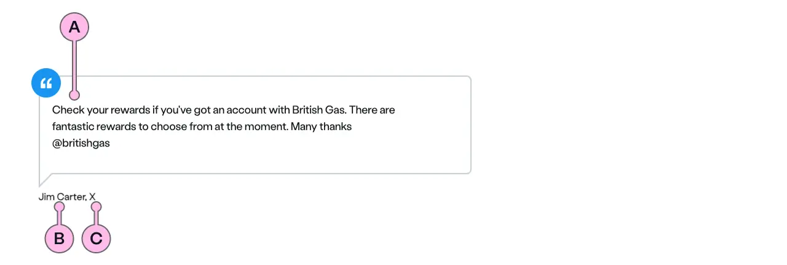

import { StorybookStory } from '../../includes/storybook-story.js'
import { ComponentPlacement } from '../../includes/component-placement.js'
import { PageFooter } from '../../includes/page-footer.js'

## Introduction

> The `ns-testimonial` component is used to display all the lovely things that people say about us.

The testimonial should be used as an enticement to buy British Gas products and services. It works by providing the customer with confidence.

## Content guidance

| Key | Field type | Guidelines |
| :--- | :--- | :--- |
| A | Quote | Verbatim comment by the author. This should be positive and giving confidence to others. Avoid sarcastic comments. |
| B | Author (name/handle) | The name or handle of the author that provided the quote. Consider if it is suitable - some pseudo names may be inappropriate. |
| C | Medium | The name of the platform that the author originally used to leave their message eg. twitter. (Also see `citeUrl` below). |

## Best practice

| 💚 Do's | 💔 Don'ts |
| :---  | :---  |
| Use a single sentence | Use multiple paragraphs |
| Use `<b>` to highlight key phrases | Link to a live twitter handle |
| Use positive feedback | Include anything negative, rude or which may be misconstrued  |
| Use multiple quotes in a row | Include any personal information beyond first name or twitter handle |

### Considerations of best practice

Use within `ns-column` to display the desired layout of multiple testimonials.

## Usage

<StorybookStory story="components-ns-testimonial--standard"></StorybookStory>

## Component placement

<ComponentPlacement component="ns-testimonial" parentComponents="ns-column"></ComponentPlacement>

## Specification

| Attribute | Type | Default | Options | Description |
| :--- | :--- | :--- | :--- |-------------|
| citeUrl | `string` |  |  | This attribute should point to information explaining the context or the reference for the quote. |
| author | `string` |  |  | The name or handle of the author that provided the quote. |
| medium | `string` |  |  | The name of the platform that the author used to leave their message eg. twitter.|
| quote | `string` |  |  | What the author wrote or said. |

## Feedback

* Do you have insights or concerns to share? You can raise an issue via [Github bugs](https://github.com/ConnectedHomes/nucleus/issues/new?assignees=&labels=Bug&template=a--bug-report.md&title=[bug]%20[ns-testimonial]).
* See all the issues already raised via [Github issues](https://github.com/connectedHomes/nucleus/issues?utf8=%E2%9C%93&q=is%3Aopen+is%3Aissue+label%3ABug+[ns-testimonial]).

<PageFooter></PageFooter>
