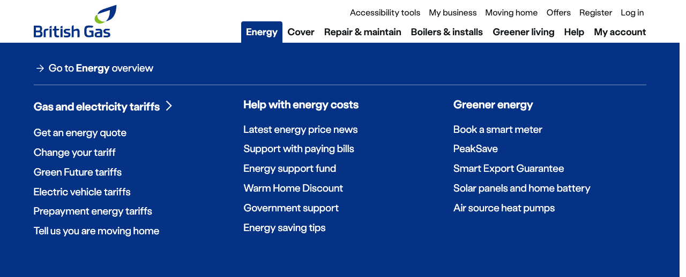

import { StorybookStory } from '../../includes/storybook-story.js'
import { ComponentPlacement } from '../../includes/component-placement.js'
import { PageFooter } from '../../includes/page-footer.js'

## Introduction

> Primary navigation for the British Gas website

This experience pattern is a wrapper of the `ns-header`. The header experience pattern internally holds the sections and the secondary navigation.

The subheadings and links for the navigation can be passed in for each section to allow them to be quickly updated.



## Best practice

| 💚 Do's | 💔 Don'ts |
| :--- | :--- |
| Use on the British Gas website. | Use for partnership or micro sites. |
| Keep the header outside the `main` element | Only have heading links |
| Keep the header at the top | |

### Considerations of best practice

* If not using nsx-footer; remember to add an id of `footer` to your footer (nsx-footer adds one automatically). This is required for the skip links.
* Remember to add an id of `content` to the main content of the page (normally the `main` element). This is required for the skip links.

## Usage

<StorybookStory story="experiences-nsx-header--standard"></StorybookStory>

## Component placement

<ComponentPlacement component="nsx-header"></ComponentPlacement>

## Specification

| Attribute | Type | Default | Options | Description |
| :--- | :--- | :--- | :--- | :--- |
| `sections`    | `array` | |  | Subheadings and links for each nav section |
| `hideA11yBtn`    | `boolean` | `false` |  | Ability to turn off Reciteme |

| Event | Description |
| :--- | :--- |
| `header-click` | Sends an event when a link is clicked. `{ text: 'Link text', href: 'Link href', header: 'Header', subheader: 'Sub Header' }` |

| Slots | Type |
| :--- | :--- |
| `link-*` | `a tag` |

## Specification notes

### Dynamic link slot

* This needs to follow the correct structure.
* This is a dynamic slot.
* This must follow a flat DOM structure of just an anchor tag.

## Section structure

```json
[
  [
      {
        "heading": "Gas & electricity",
        "links": [
          {
            "text": "Gas & electricity services",
            "href": "/energy.html"
          },
          {
            "text": "Our gas & electricity tariffs",
            "href": "/energy/gas-and-electricity.html"
          },
          {
            "text": "Get a quote",
            "href": "/GetAQuote/"
          },
          {
            "text": "Connections for new builds",
            "href": "/energy/gas-and-electricity/new-connections.html"
          },
          {
            "text": "Warm Home Discount",
            "href": "/energy/energy-saving/warm-home-discount.html"
          }
        ]
      },
      ...
  ],
  ...
]
```

## Feedback

* Do you have insights or concerns to share? You can raise an issue via [Github bugs](https://github.com/ConnectedHomes/nucleus/issues/new?assignees=&labels=Bug&template=a--bug-report.md&title=[bug]%20[nsx-header]).
* See all the issues already raised via [Github issues](https://github.com/connectedHomes/nucleus/issues?utf8=%E2%9C%93&q=is%3Aopen+is%3Aissue+label%3ABug+[nsx-header])

<PageFooter></PageFooter>
