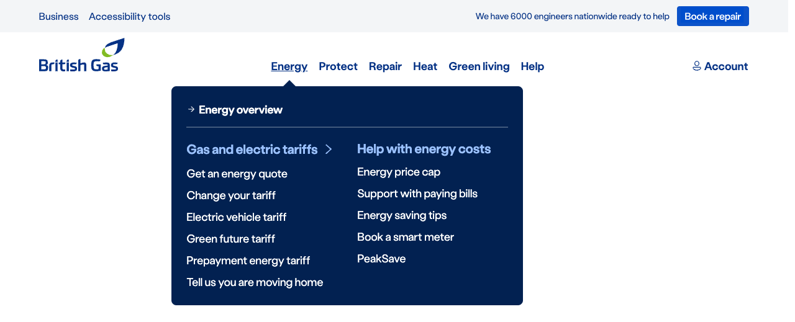

import { StorybookStory } from '../../includes/storybook-story.js'
import { ComponentPlacement } from '../../includes/component-placement.js'
import { PageFooter } from '../../includes/page-footer.js'

## Introduction

> Primary navigation for the British Gas website

This experience pattern is a wrapper of the `ns-header`. The header experience pattern internally holds the sections and the secondary navigation.

The subheadings and links for the navigation can be passed in for each section to allow them to be quickly updated.



## Best practice

| 💚 Do's | 💔 Don'ts |
| :--- | :--- |
| Use on the British Gas website. | Use for partnership or micro sites. |
| Keep the header outside the `main` element | Only have heading links |
| Keep the header at the top | |

### Considerations of best practice

* If not using nsx-footer; remember to add an id of `footer` to your footer (nsx-footer adds one automatically). This is required for the skip links.
* Remember to add an id of `content` to the main content of the page (normally the `main` element). This is required for the skip links.

## Usage

<StorybookStory story="nsx-header--standard"></StorybookStory>

## Component placement

<ComponentPlacement component="nsx-header"></ComponentPlacement>

## Specification

| Attribute | Property | Type | Default | Options | Description |
| :--- | :--- | :--- | :--- | :--- | :--- |
| `sections`    | `sections` | `array` | |  | Subheadings and links for each nav section |
| `hide-a11y-btn` | `hideA11yBtn` | `boolean` | `false` |  | Ability to turn off Reciteme |
| `secondary-banner` | `secondaryBanner` | `array` |  |  | Top right section, includes a paragraph and a cta |
| `menu-banner` | `menuBanner`| `array` |  |  | Section within the bubble, includes a paragraph and a cta |
| `quick-links` | `quickLinks` | `array` |  |  | Subheadings and links to the right of the primary navigation |

| Event | Description |
| :--- | :--- |
| `header-click` | Sends an event when a link is clicked. `{ text: 'Link text', href: 'Link href', header: 'Header', subheader: 'Sub Header' }` |

| Slots | Type |
| :--- | :--- |
| `link-*` | `a tag` |

## Specification notes

### Dynamic link slot

* This needs to follow the correct structure.
* This is a dynamic slot.
* This must follow a flat DOM structure of just an anchor tag.

## Section structure

```json
[
  [
      {
        "heading": "Gas & electricity",
        "links": [
          {
            "text": "Gas & electricity services",
            "href": "/energy.html"
          },
          {
            "text": "Our gas & electricity tariffs",
            "href": "/energy/gas-and-electricity.html"
          },
          {
            "text": "Get a quote",
            "href": "/GetAQuote/"
          },
          {
            "text": "Connections for new builds",
            "href": "/energy/gas-and-electricity/new-connections.html"
          },
          {
            "text": "Warm Home Discount",
            "href": "/energy/energy-saving/warm-home-discount.html"
          }
        ]
      },
      ...
  ],
  ...
]
```


## Secondary banner structure

The `secondary-banner` is an array that should only contain one object. If multiple are passed, only the first object will be used. The object in the array has the following properties:


- `text`: A string representing the paragraph.
- `link`: An object with the following properties:
  - `href`: A string representing the link's href.
  - `text`: A string representing the link's text.

```json
[{
  "text": "We have 152 engineers working in Croydon ready to help",
  "link": {
    "href": "/",
    "text": "Book a repair"
  }
}]
```

## Menu banner structure

The `menu-banner` is an array of menu banner sections. Each menu banner section is represented by an object with the following properties:

- `text`: A string representing the paragraph.
- `link`: An object with the following properties:
  - `href`: A string representing the link's href.
  - `text`: A string representing the link's text.
  - `type`: A string representing the cta type, defaults to `direct` if not set.

```json
[{
  "text": "Sample copy for the menu banner",
  "link": {
    "href": "/",
    "text": "cta  copy"
  }
},
null, // no menu-banner
{
  "text": "paragraph with no cta",
},
{
  "link": {
    "href": "/",
    "text": "No paragraph above the cta"
  }
},
{
  "link": {
    "href": "/",
    "text": "no paragraph, and text cta",
    "type": "text"
  }
}]
```

## Quick links structure

`quick-links` is an array that contains two sub-arrays, each of which contains objects representing quick links. The first sub-array contains the object(s) for the default state (unauthenticated), while the second sub-array contains the object(s) for the authenticated state.

- `heading`: A string representing the heading.
  - `href`: A string representing the heading's href.
  - `links`: An array of objects representing the quick links, each object has the following properties:
    - `text`: A string representing the link's text.
    - `href`: A string representing the link's href.
    - `data-ns-link`: A dynamic link slot. This must follow a flat DOM structure of just an anchor tag.


```json
[
  [
    {
      "heading": "Default quick links",
      "href": "/",
      "links": [
        {
          "text": "XXXXX",
          "href": "/"
        },
        {
          "text": "YYYYY",
          "href": "/"
        }
      ]
    }
  ],
  [
    {
      "heading": "Logged in ccount quick links",
      "href": "/energy/tariffs.html",
      "links": [
        {
          "text": "View statements",
          "href": "/"
        },
        {
          "text": "View meter readings",
          "href": "/"
        }

      ]
    },
    {
      "heading": "XXXXXX",
      "href": "/",
      "links": [
        {
          "text": "Your tariff details",
          "href": "/"
        },
        {
          "text": "Choose a new tariff",
          "href": "/"
        }
      ]
    }
  ]
]
```

## Feedback

* Do you have insights or concerns to share? You can raise an issue via [Github bugs](https://github.com/ConnectedHomes/nucleus/issues/new?assignees=&labels=Bug&template=a--bug-report.md&title=[bug]%20[nsx-header]).
* See all the issues already raised via [Github issues](https://github.com/connectedHomes/nucleus/issues?utf8=%E2%9C%93&q=is%3Aopen+is%3Aissue+label%3ABug+[nsx-header])

<PageFooter></PageFooter>
