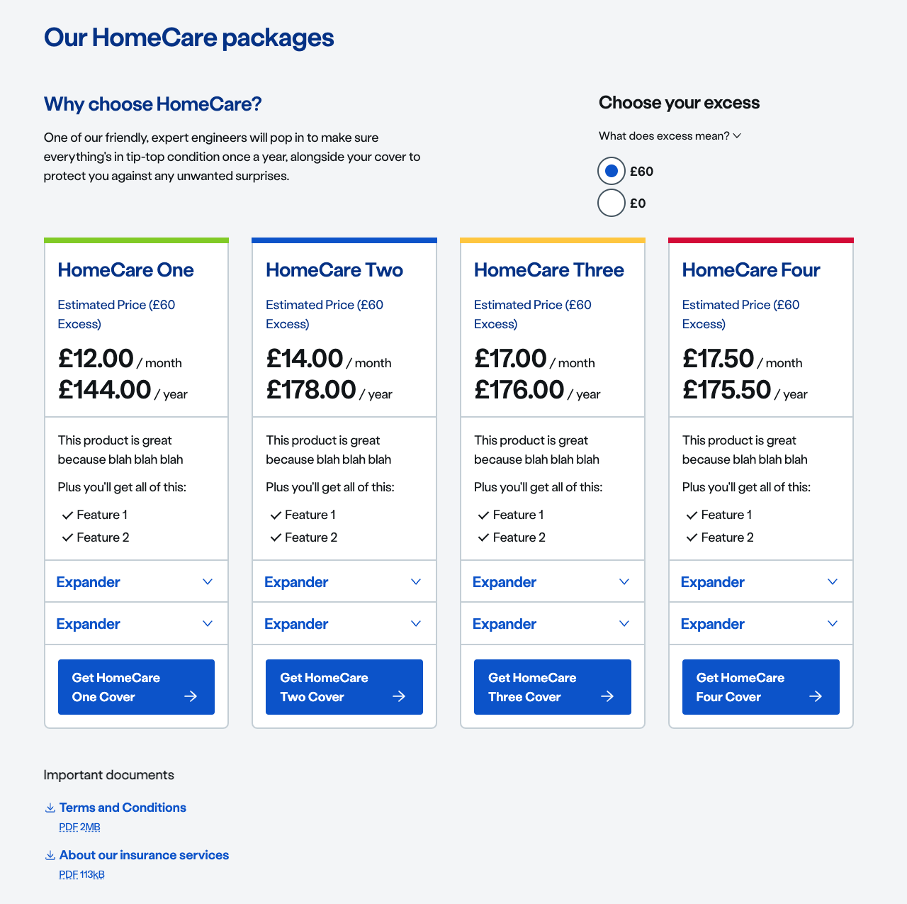
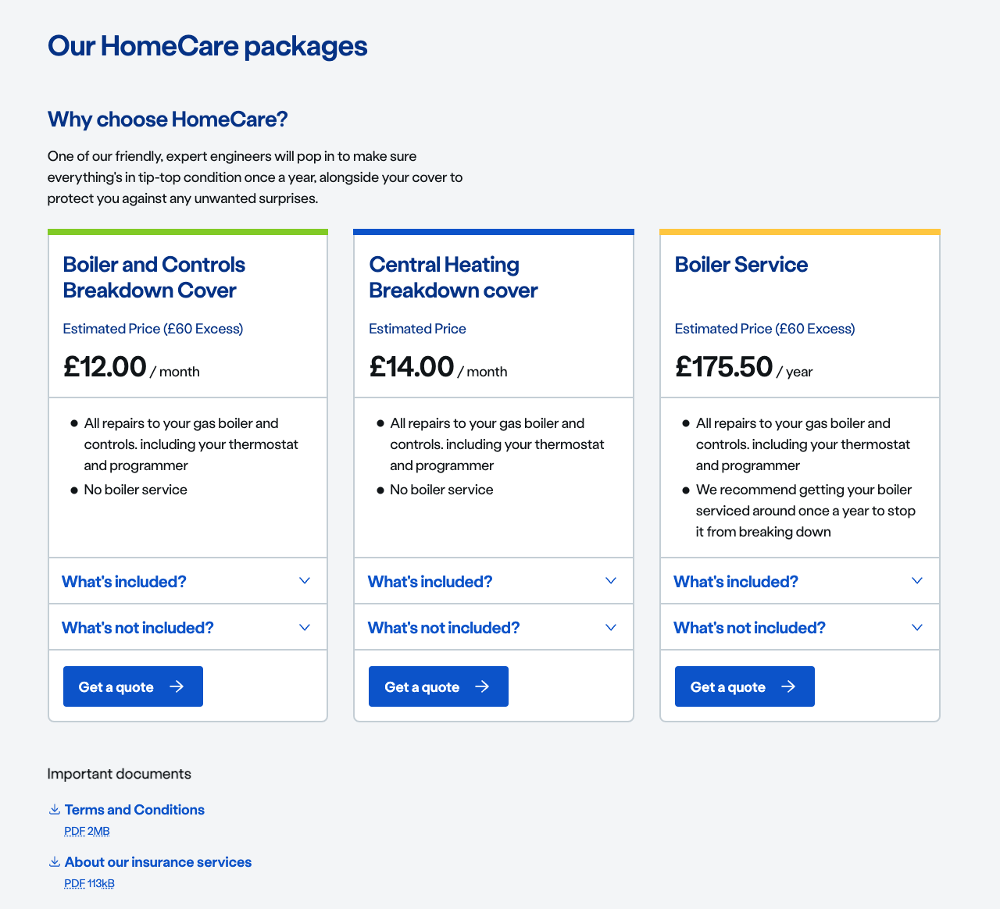

import { ComponentPlacement } from '../../includes/component-placement.js'
import { PageFooter } from '../../includes/page-footer.js'

## Introduction

The product card overview is an experience pattern that can be used to compare HomeCare products against each other and see the difference in price when choosing to have an excess or not - without having to reload the entire page.

## Content guidance

Wrap the overview component in `ns-panel` and use its `decoration` attribute for decoration. It is possible to use any [decoration](ns-panel#specification) for ns-panel. However we recommend to use **only** `invert-concave-grey-light` decoration for better accessibility of the contents inside the overview component.

```markup
<ns-panel decoration="invert-concave-grey-light">
    <nsx-product-card-overview></nsx-product-card-overview>
</ns-panel>
```

### With Excess

When `excess` property of the overview component is set with an array of price options, the excess prices are displayed as radio options in the overview component. When a user selects a radio option, an `excess-change` event is dispatched from the overview component. The consuming wrapper component has to listen for the event and sets the updated ns-product-card prices back in the `pricing` attribute of the component.

#### Usage

```markup
<nsx-product-card-overview excess="[60,0]" pricing='[{"monthly": {"now": 1200},"annually": 14400,"excess": 90}]' priceheading="Estimated Price"></nsx-product-card-overview>
```



### Without Excess

#### Usage

```markup
<nsx-product-card-overview pricing='[{"monthly": {"now": 1200},"annually": 14400,"excess": 90}]' priceheading="Estimated Price"></nsx-product-card-overview>
```



### Was / Now Pricing

To display the price offer of a product in the overview component, `was / now` option in `monthly` pricing can be used to display the original and current price. The `was` price is displayed with `Was` prefix and a strikethrough in the price. The `now` price is displayed with `Now` prefix, when accompanied with `was` price. The `was` price is optional whereas `now` price is mandatory. `was / now` option can be used with / without Excess pricing.

#### Usage

```markup
<nsx-product-card-overview pricing='[{"monthly": {"was": 1200,"now": 1000},"annually": 14400,"excess": 90}]' priceheading="Estimated Price"></nsx-product-card-overview>
```


### With Monthly Now Primary/Secondary

To allow a display of a special offer which requires the `now` price to have two different values you can supply it with the following shape:

```javascript
now: {
  'primary-prefix': null,
  'primary-price': 500,
  'primary-extra': 'for the first 3 months',
  'secondary-price': 1000,
  'secondary-prefix': 'Then'
}
```

#### Usage

```markup
<nsx-product-card-overview pricing='[{"monthly": {"was": null, "now": {"primary-price": 500, "primary-extra": "for the first 3 months", "secondary-price": 1000, "secondary-prefix": "Then"} }, "excess": 60}]' priceheading="Estimated Price"></nsx-product-card-overview>
```


## Specification

| Attribute | Type | Default | Options | Description |
| :--- | :--- | :--- | :--- | :------ |
| `pricing` | `array` | `[]` | `required` | The list of price values to be updated in the product card price slots. Each product card price has `monthly`, `annually` and `excess` values. `monthly` price holds  `was` and `now` price. `was` price represents the original price and `now` price represents the current price of the product. |
| `excess` | `array` | `[]` | `optional` | The list of excess prices that will be displayed as radio options to the user for excess selection|
| `priceheading` | `string` | `Estimated Price` | `optional` | The product card price heading prefix used to display in product card price heading slot along with excess value if any|

| Slots | Type |
| :--- | :--- |
| `heading` | `h` tag |
| `content` | `ns-content` tag |
| `product-*` |  `ns-product-card` tag |
| `download-files` | `ul` tag with nested multiple`li` of `ns-download` for multiple files |

## Events

| Event | Description | Details |
| :--- | :-----| :--- |
| `excess-change` | Dispatched when the user changes the excess price radio option | |

## Best practice

| 💚 Do's | 💔 Don'ts |
| :--- | :--- |
| Always use `pricing` attribute to set price in product cards. | Use `price` slot in each product card  |
| Always use `priceheading` attribute to set price heading in product cards. | Use `price-heading` slot in each product card |
| Always use `ns-content` for `content` slot to add subheading and description of the overview component. |  |

## Component placement

<ComponentPlacement component="nsx-product-card-overview" parentComponents="ns-panel"></ComponentPlacement>

## Feedback

* Do you have insights or concerns to share? You can raise an issue via [Github bugs](https://github.com/ConnectedHomes/nucleus/issues/new?assignees=&labels=Bug&template=a--bug-report.md&title=[bug]%20[nsx-marketing-consent]).
* See all the issues already raised via [Github issues](https://github.com/connectedHomes/nucleus/issues?utf8=%E2%9C%93&q=is%3Aopen+is%3Aissue+label%3ABug+[nsx-marketing-consent]).

<PageFooter></PageFooter>
