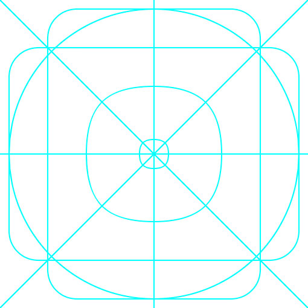
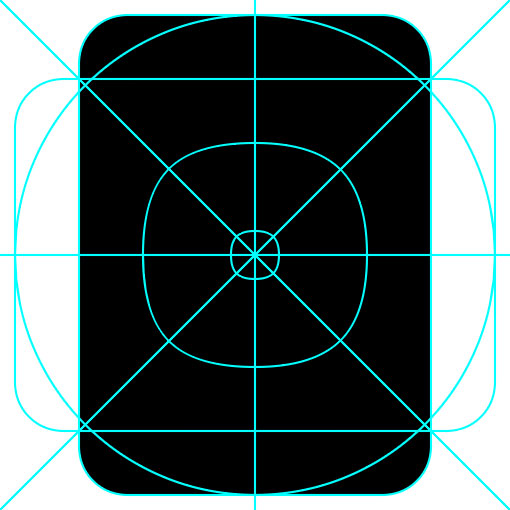
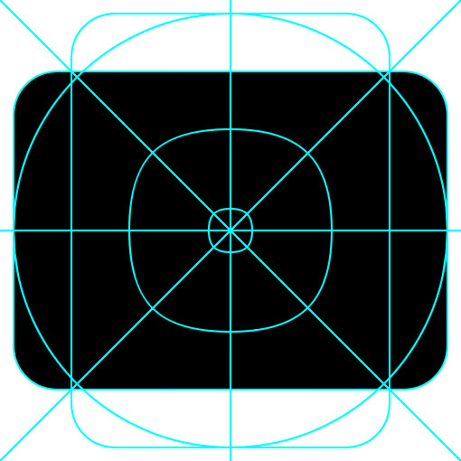
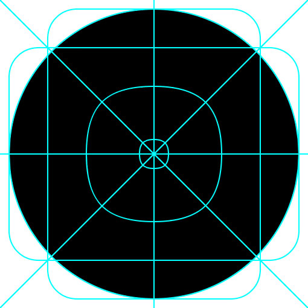

## Why we use icons

Icons are used within our design system to represent an object or action visually to our users. Helping customers visually navigate our world. Done well, icons should help provide clarity to users reducing the cognitive load required to complete a task.

They are functional, rather than decorative and should be used sparingly, only within the parameters they were created for.

A list of all the icons that are available in Nucleus can be found on [storybook](https://www.britishgas.co.uk/nucleus/demo/index.html?path=/story/components-ns-icon--all-icons)

## How we use icons

We use icons in number of different ways to convey meaning:

* Signposting and navigation.
* Navigational or informational signposts for content.
* Illustrates content with a simple and clear visual.
* Used by themselves at large size or smaller within a roundel.

If you are using the icon at a very large size to engage and visual impact, consider if an illustration might be better.

## Categories

### Clarifying

Used as a visual aid for some functions, categories or actions. These are not used as a direct element of interaction themselves but can help to signify and support an action. It is recommended that these aren't used in isolation and should be accompanied by copy to add context.

### Functional

Used to show where an action needs to be taken. This includes components like buttons, controls. For instance a button might include an arrow to give the user an indication of what will happen next or a download icon to show that the user will receive something by pressing it. Functional icons can also be further split into interactive and non-interactive icons.

### Logos/marks

We can make use of brand logos and marks when we discuss products and companies. Examples of these may include: British Gas, Hive or Dyno.

## Colour

| 💚 Do's | 💔 Don'ts |
| :--- | :--- |
| Start with using BG Cyan or BG Slate | Mix two secondary colours together |
| Use colours that meet WCAG AA colour contrast ratio requirements on specific coloured backgrounds (mainly achieved automatically by the system) | Use non-conforming contrasts |
| Colour interactive functional icons in Secondary Blue - see [Colours](https://foundations/colours.md)|  |

## Creating new icons

If you are looking to create a new icon then please check there is not something similar already in use. If there is no suitable icon then you should let us know and we can look at creating it for the design system. All new icons and illustrations need to be approved by the brand team.

### Icon creation guidelines

- We make sure that a similar icon is not already in use.
- Use the icon grid to ensure consistency with existing icons.
- We make sure icon works across different sizes.
- We create both solid and outline versions (Solid over outline, unless icon is interactive).
- Consistent stroke thickness based on sizes (At least 2px for stroke to avoid odd resizing issues or using fills with strokes).
- Clean and simple forms using our shapes.
- Flat shapes over 3d forms.
- Rounded corners should make an icon feel friendly, not childish.
- Icon should be one topic, we don't overlay or intersect an icon with another icon.
- Text shouldn't be added to an icon as this will break accessibility.
- Icons are only one colour.
- Minimise the number of anchor points as much as possible; every anchor point will add to the file weight as we export icons in SVG format, not bitmaps.
- Retain the naming convention (see below).

### Icon naming convention

When creating new icons, we use a particular method for naming them that ensures consistency and understanding.

Use a descriptive name for the content of the icon. For example, if you have created a pencil icon, call it `pencil` and not `edit`. Describe the icon itself, not how it is used, as that can potentially change.

### Icon grid

We use a grid for icon creation to give consistency across our icons. You should also be considering where your paths sit, to be as close to pixel perfect as possible. Here are examples of the grid and basic shapes to show it's usage:

| Grid | Grid - Vertical | Grid - Horizontal | Grid - Circle |
| :--- | :--- | :--- | :--- |
|  |  |  |  |

### Sizing

Icons are created using illustrator with a 32px x 32px art-board. This allows scaling both up and down of the icon’s size. The Nucleus Design System scales across different screen sizes meaning elements, including the icon’s scale to retain their visual proportions. We ensure icon works between 16px and 72px.

### SVG best practices

- We use only paths not shapes.
- Paths align to the pixel grid.
- Corners have only 2 points to minimise file size.
- Icon colour is set to black.
- All unnecessary attributes in the SVG document are removed including:
   * `<title>` element.
   * Any `id=””` attributes.
   * All `data-name=””` attributes if they exist.
   * All colour information e.g. `fill="#000000"`.
   * `<style>` and any `classes`.
   * Nested and empty `<g>` (groups).
   
## Related links

* [ns-icon](https://components/ns-icon.md)
