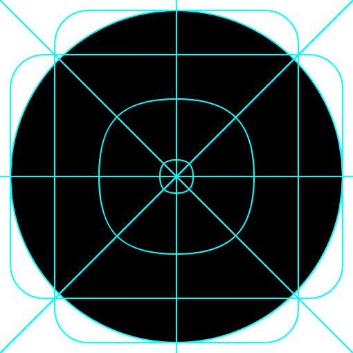

## Why we use illustrations

We use illustrations to bring warmth of our brand personality to the website. We use bold, geometric shapes to make our complicated world feel friendly and accessible.

Nucleus British Gas illustrations.

## How we use illustrations

* Within infographics to make our messages easier to understand.
* Used on their own as the primary visual element.
* Layered over photography to enhance our stories.
* We use illustrations at larger sizes to draw use attention to areas of interest.

## Creating new illustrations

If you are looking to create a new illustration then please check there is not something similar already in use. If there is no suitable illustration then you should let us know and we can look at creating it for the design system. All new icons and illustrations need to be approved by the brand team.

### Illustration creation guidelines

* We make sure that a similar illustration is not already in use.
* Use the illustration grid to ensure consistency with current icons.
* We make sure illustration works across different sizes.
* Design clean and simple forms using our shapes.
* Use flat shapes over 3d forms.
* Use consistent flat colours. Do not use multiply blend modes or opacities.
* Rounded corners should make icon feel friendly, not childish.

### Illustration grid

We use a grid for icon creation to give consistency across our illustrations. Here are examples of the grid and basic shapes to show it's usage:

| Grid | Grid - Vertical | Grid - Horizontal | Grid - Circle |
| :--- | :--- | :--- | :--- |
|  |  |  |  |

### Colour

Each illustration uses predominantly a 2-colour pair from the below array:

#### Cyan and Blue

#### Lime and Forest

#### Yellow and Red

#### Highlights

Our illustrations use `white` (#FFFFFF) to highlight details within the object.

#### Placement and contrast

We should be mindful of the colour background on which these illustrations will be situated. For example, if choosing a decoration for a containing component such as ns-panel we should ensure a good contrast.
