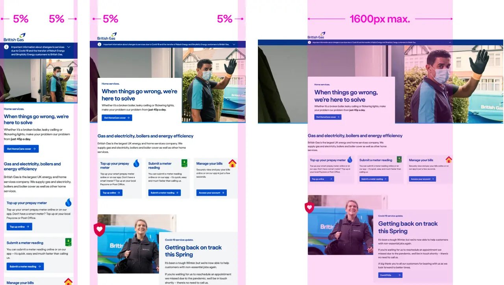
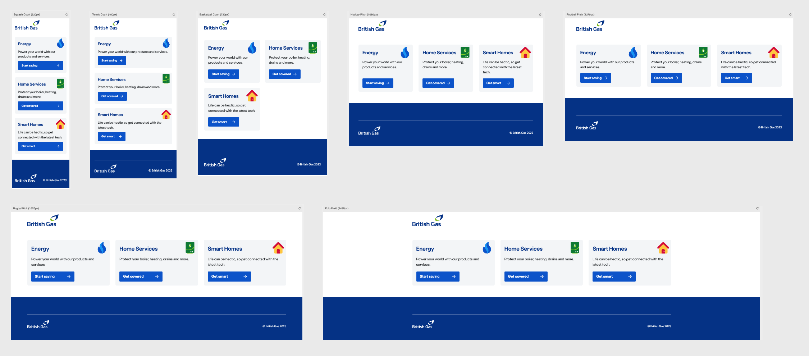

The word 'structure' in this context is used as the term to encapsulate how a document and pieces of a document are put together.

There are five pieces of the design system that work together to make our structure.

**1. HTML** - The fundamental building blocks of the Web. In order to get the most from Nucleus it is important that the structure of the HyperText Markup Language is correct.

```html
<!DOCTYPE html>
<html lang="en" dir="ltr">
  <head>
    ...
  </head>
  <body class="ndsn">
    ...
  </body>
</html>
```

**2. Panel** - `<ns-panel>` is always a child of the `<main>` element or it's encapsulated within a component that is a child of the `<main>` element.

```html
<main>
  <ns-landmark> ... </ns-landmark>
  <ns-panel> ... </ns-panel>
  <ns-panel> ... </ns-panel>
  <ns-editorial> ... </ns-editorial>
  <ns-caveat> ... </ns-caveat>
</main>
```

**3. Layout** - This is the area within `<ns-panel>` that either adopts the natural behaviour defined by itself, or having a class applied to either a `<div>` or `<ns-column>`.

```html
<ns-panel>
  <div> ... </div>
  <ns-column> ... </ns-column>
</ns-panel>
```

**4. Columns** - To introduce a column structure use either a class `<div class="triple">` or include attributes on the `<ns-column>` component.

```html
<ns-panel>
  <div class="triple"> ... </div>
  <ns-column hockeypitch="3"> ... </ns-column>
</ns-panel>
```

**5. Component** - Within our components we include responsive columns and layout decisions.

```html
<ns-card type="section"> ... </ns-card>
```

## 1. HTML

In it's basic form, the markup for the most performant and accessible page starts with the following:

Here is the [Nucleus HTML Structure](https://github.com/ConnectedHomes/nucleus/issues/1055#issue-555478278) in Github.

## 2. Panel

This piece of our structure provides a container for a single topic or task. Think of `<ns-panel>` as a part of a document which may contain multiple sections.

## 3. Layout

The general layout of our components fits within a content area in between margins that are generally and equally 5% of the total viewport width, up to 1,600 px wide. When that happens, the main content area remains fixed at that size, but the left and right margins then expand equally to fill the rest of the horizontal space as the viewport width increases over 1,600 px.

It allows our layouts to respond to different devices dynamically and be optimal for comfortable scanning and content consumption.



## 4. Columns

When we discuss columns, we often refer to layout and the `ns-column` component. Some of our components have column behaviour baked into them.

An example of a component that adapts its appearance responsively within a column layout is the section variant of `ns-card`.

### `<ns-card>`

In this screenshot we can observe the responsive behaviour of the `section` card.

In `squash-court` a card will fill the horizontal width of the content area between the left and right margins, the `ns-cta` also stretching across full width to aid user interaction as this width would typically be a touch device.

In `tennis-court` the cards are still filling the one central column but the ns-cta has adapted to be shorter in width.

In `basketball-court` the cards have been defined in the `ns-column` properties to fit across 2 columns to produce a comfortable reading experience.

In `hockey-pitch` the cards have been defined in the `ns-column` properties to adapt to a 3 column layout.

Then in `rugby-pitch` and above, the cards, still defined to fit a 3 column layout, remain at the same width but the margins expand thereon.



### `<ns-lockup>`

The `ns-lockup` typically contains a two column layout at `hockey-pitch` and above, with a 50%/50% layout.

### `<ns-landmark>`

The landmark, notably the summit variant changes in many ways. Starting at 100% in `squash-court` and `tennis-court` then adapting to keep the content high in the view in `basketball-court`, then a 60%/40% layout in `hockey-pitch` and above.

## 5. Component

Each of our components can adopt a relevant layout at any of our viewports in order to take advantage of the best responsive solution.

This can be seen in the responsive behaviour of the section card where the illustration moves from left to right depending on the best use of space.


### `<ns-appointment-picker>`

Displays stacked at `squash-court` -> `basketball-court` and then a side-by-side consuming 100% width in `basketball-court` and then, 66% width in `hockey-pitch` and above.

### `<ns-card>`

The cards that adapt the most are `section` and `support with image`

### `<ns-editorial>`

An image can be left or right, from `hockey-pitch` and larger but they will display on the right only and stack at smaller viewports.

### `<ns-alert>`

The highlighter variant of the `ns-alert`'s icon swaps from a stacked position in `squash-court` to the left in larger viewports, to optimise the space used.

### `<ns-landmark>`

Lots of responsive decisions are contained within each `ns-landmark` for example, the `summit` variant there is no `card` at `squash-court` and `tennis-court` and at `basketball-court` the card overlaps the image. At `hockey-pitch` and above the card sticks to the left in a 60%/40% layout.

### `<ns-lockup>`

The ns-lockup behaves responsively too, adjusting its overlaps most appropriately for the given viewport.

### `<ns-selector>`

The image within `ns-selector` adapts to different positions and sizes.

### Components that are placed outside of `ns-panel`

- `<ns-landmark>`
- `<ns-editorial>`
- `<ns-caveat>`
- `<ns-footer>`
- `<ns-header>`
- `<ns-skyline>`

<!--Removed 'Functional vs Promotional' paragraph due to references to deprecated terms for widths - slim, norm, wide. If such distinction is still required, we can look to add this here.-->
