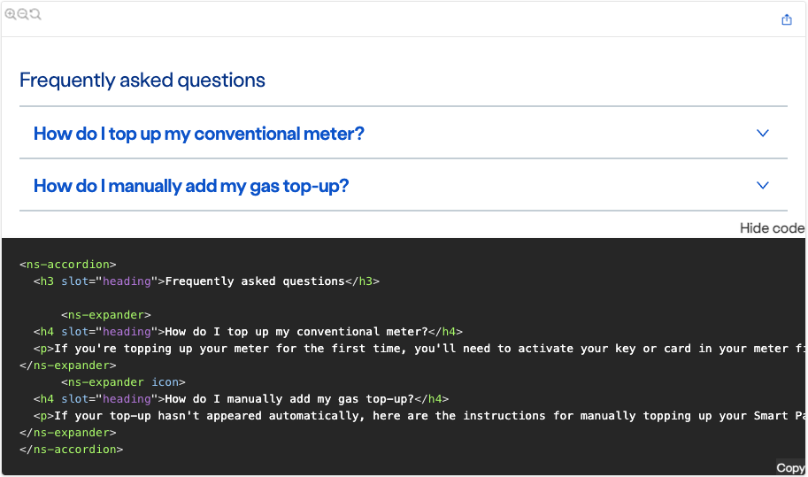
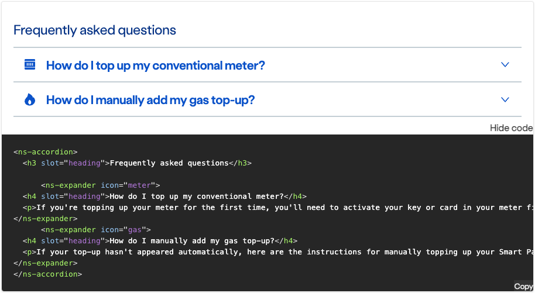

## Guidance

It would be a 'nice to have' if we can dynamically generate these with a tool-tip type explanation on selection - maybe something akin to what you are sometimes presented with as a tour on a newly installed software? Fallback/MVP will be to continue to use these existing image diagrams.

  

| Key | Field type | Guidelines |
| :--- | :--- | :--- |
| A | Heading | The recommended length is between 4 and 12 words, not exceeding 50 characters in total.  |
| B | Content | Use between 1 and 8 [ns-expander](components/ns-expander.md) components. All expanders need to be related to the accordion's heading.|

### Code snippets
You can copy these examples and paste them in to your prototypes in Nucleus Playground where you can configure them.

#### Accordion without icons
(Example preview and snippet goes in here)
  

#### Accordion with icons
(Example preview and snippet goes in here) Please see ns-icon to see icon options.
  

### Figma component configuration?
Perhaps this could be an opportunity to link here to the specific ['Configuration instructions'](https://www.figma.com/file/HdnAatpIIliZhoj6C77aHx/Nucleus-BritishGas---Components?type=design&node-id=1876%3A35073&mode=design&t=AhbXHdhQS8wMDls0-1) each Figma component already has but doesn't have much exposure due to library components being searched and pulled into designs without reading? Self-help for designers and less chances of void inventions.

However, it may not be possible (or relevant?) as the Nucleus British Gas Figma UI Kit resides on the British Gas Figma Workspace and is not open to the 'public' or anyone outside of that group.


+++++++++++++++

#### Example code block using CSS style
```css
:root {
	/*--sl-content-width: 50rem; */
	/* Text size */
	--sl-text-5xl: 4rem; /* 42px */
	
}


	/* Dark mode colors. */
	:root {
		--sl-color-accent-low: #131e4f;
		--sl-color-accent: #3447ff;
		--sl-color-accent-high: #b3c7ff;
		--sl-color-white: #ffffff;
		--sl-color-gray-1: #eceef2;
		--sl-color-gray-2: #c0c2c7;
		--sl-color-gray-3: #888b96;
		--sl-color-gray-4: #545861;
		--sl-color-gray-5: #353841;
		--sl-color-gray-6: #24272f;
		--sl-color-black: #17181c;
	}
	/* Light mode colors. */
	:root[data-theme='light'] {
		--sl-color-accent-low: #c7d6ff;
		--sl-color-accent: #364bff;
		--sl-color-accent-high: #182775;
		--sl-color-white: #17181c;
		--sl-color-gray-1: #24272f;
		--sl-color-gray-2: #353841;
		--sl-color-gray-3: #545861;
		--sl-color-gray-4: #888b96;
		--sl-color-gray-5: #c0c2c7;
		--sl-color-gray-6: #eceef2;
		--sl-color-gray-7: #f5f6f8;
		--sl-color-black: #ffffff;
	}
```

#### Example code block using HTML style

```html
 <ns-inputter value mask="000000" validation="[&quot;isRequired&quot;]">
  <label slot="label">Mask</label>
  <input type="text">
</ns-inputter>

```

Example typograhy:

# Heading 1
## Heading 2
### Heading 3
#### Heading 4
##### Heading 5
###### Heading 6

