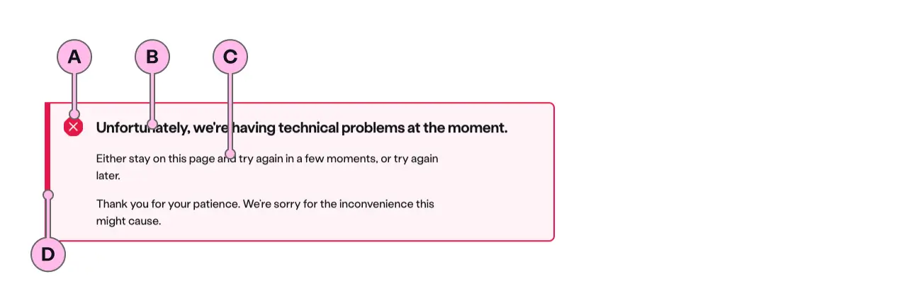

## Standard

:::caution[Content guidance]
_(markdown)_ This will be the position for the component content guidance

- Which will contain the image or the dynamic interactive element
- Taking inspiration from the Product Tour concept
:::

:::note[ns-alert]
_(automated)_ This will be the position for the component example

```html
<ns-alert>
  <p>Here will be the code snippet of ns-alert</p>
</ns-alert>
```
:::

## Highlighter



| Key | Field type | Guidelines |
| :--- | :--- | :--- |
| A | Icon | This is the icon inside the `highlighter` type. This is dictated by the `state` of Alert. The [specification table](#specification) has a list of options. |
| B | Heading | The recommended length is between 4 and 12 words, not exceeding 50 characters in total. |
| C | Content | A single, short paragraph works best. You are able to use inline text links within the paragraph if necessary. Don't add additional headings within the paragraph and the copy length should not exceed more than two paragraphs of 3 lines each. Can contain bold copy `<b>`, inline links `<a>`, and a caveat at the end of the relevant paragraph if required `<a href="#caveat">1</a>`. |
| D | Accent | This is to support the context of the messaging. This colour matches that of the icon. |

## States

### Error

For communicating failure with urgence. A task cannot be completed without the user remedying something.


### Informational

For communicating a useful piece of information that the user might find helpful to carry out their action.


### Success

For communicating that an action has been successful.


### Warning

Use for communicating a piece of information with less severity. These include foreseeable problematic events, failures, outages and how to avoid errors.


