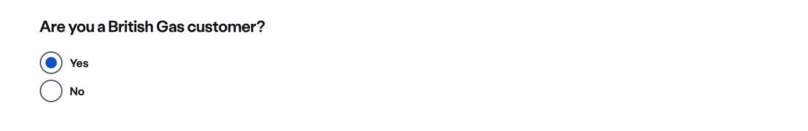
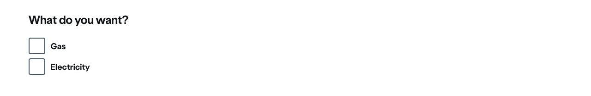
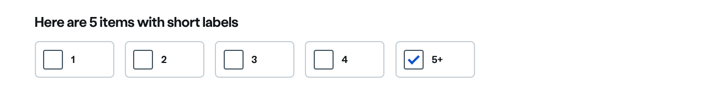
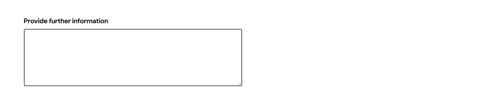

### Headings

The `heading` attribute is used for checkboxes and radio buttons to provide a `<legend>`. These are usually in the form of a question - such as "Are you a British Gas customer?".

| 💚 Do's | 💔 Don'ts |
| :--- | :--- |
| Use to Introduce a set of checkboxes or radio buttons |  |
| Use for questions |  |
| Use sentence case |  |
| Only use text |  |
| Punctuate sentences |  |

### Labels

Every input requires a label. Your labels should be easy to read and understand. You must not use a placeholder as a label.

| 💚 Do's | 💔 Don'ts |
| :--- | :--- |
| Be concise | Use full stops |
| Use `<label>` element | Add classes to labels |
| Use sentence case | Use as links |
| Only use text | Rely on placeholders |
|  | Put links in the label |

### Helper text

The `helper` attribute allows you to add a message between the label and the input to help the user to fill in the input.

When used with radio buttons or checkboxes, this will appear between the `<legend>` and the options.

| 💚 Do's | 💔 Don'ts |
| :--- | :--- |
| Keep it to one line | Use for error messaging |
| Use it to explain why we need information | Put examples of inputs inside |
| Use it when the reason for asking maybe unclear |  |
| Use as a prompt |  |

### Tip Detail

If you need to provide more detailed context to the options available, you can use the tip detail in conjuntion with the `helper`.

| 💚 Do's | 💔 Don'ts |
| :--- | :--- |
| Use to provide additional context to helper text | Repeat helper text |
| Use basic formatting for copy | Add imagery |
| Use as an explanation | Exceed two paragraphs. Link off if necessary |
| Use as a prompt |  |

### Placeholder

The `placeholder` is for providing the customer with an example of what you expect them to input into the field. This should not be used as a replacement for either a `<label>` or `helper` text.

| 💚 Do's | 💔 Don'ts |
| :--- | :--- |
| Provide example of expected input | Use real data |
| Use 'eg.' before example | Use as an explanation or a prompt |

### Validation

Validation is there to assist the customer in providing valid information. If information is missing, or the information they have provided does not align with the field type, then an error message is displayed so enable the customer to identify the mistake, and help them to correct it.

The following is a list of validation types that `<ns-inputter>` supports. These can be used individually or in a combination:

|  **Validation type**  | **Usage** |
| :--- | :--- |
| `isRequired` | value must be completed |
| `isNumber` | value must be a number | 
| `isInteger`| value must be a whole number with no decimal point | 
| `isPostcode(includeEIR)` | value must be a valid UK or Ireland postcode |
| `isFirstName` | value must only contain letters, apostrophes, or hyphens. There is a character limit of 24 |
| `isLastName` | value must only contain letters, apostrophes, or hyphens. There is a character limit of 32 |
| `isFullName` | value must only contain letters, apostrophes, or hyphens. There is a character limit of 60 | 
| `isTitle` | value must be a valid title prefix | 
| `isEmail` | value must be in a valid email format |
| `isPhoneNumber(includeIreland)` | value must be in a valid UK or Ireland telephone format |  
| `isMobileNumber` | value must be in a valid mobile phone format | 
| `isPassword` | value must be a password | 
| `isDate` | value must be a date |
| `minDate(date)` | value must be a date no earlier than the date set in brackets |
| `maxDate(date)` | value must be a date no later than the date set in brackets | 
| `isDateOfBirth` | value must be the customers date of birth |
| `minLength(x)` | value must be no shorter in length than the number set in brackets | 
| `maxLength(x)` | value must be no longer in length than the number set in brackets |

| 💚 Do's | 💔 Don'ts |
| :--- | :--- |
| Use only when required | Use real data |
| Only use to validate the format of the input | Don't used for... |

### Masks and separators

The `mask` is similar to a placeholder, this can be used to show what can be entered. However it stays when values are entered.

The `separator` is used with the mask to manipulate the inputted value if it needs to be formatted in a certain way, like as a sort code or reference number.

[See `<ns-inputter>` mask on Storybook](https://www.britishgas.co.uk/nucleus/demo/index.html?path=/story/form-ns-inputter--mask).

[See `<ns-inputter>` separator on Storybook](https://www.britishgas.co.uk/nucleus/demo/index.html?path=/story/form-ns-inputter--separator).

| 💚 Do's | 💔 Don'ts |
| :--- | :--- |
| Only use an input type | Use a textarea, checkbox or radio button |
| Only use a character for a separator | Use a "placeholder" attribute on the input |
|  | Put more than one separator together, e.g. `00--00` |
|  | Start or end with a separator |

## Autocomplete and input sizing

- Use native autocompletes on inputs ([Autocomplete attribute documentation](https://developer.mozilla.org/en-US/docs/Web/HTML/Attributes/autocomplete))
- Inputs will resize when using the autocomplete attribute for `honorific-prefix`, `given-name`, `family-name` and `postal-code`.

### Text

The text input is ideal for entering text that takes up a single line, such as asking a customer their name or email address. If you require a longer answer from a customer then you should use the textarea input type.

[See `<ns-inputter>` text input on Storybook](https://www.britishgas.co.uk/nucleus/demo/index.html?path=/story/form-components-ns-inputter--text-input).

| 💚 Do's | 💔 Don'ts |
| :--- | :--- |
| Only use our specified text type. (eg. Text, Email etc) | Use more than one text input within an inputter |
| Use autocomplete attribute | Put anything inside the text input |
| Base width of input on expected length of input |  |
| Make your labels easy to read and understand |  |

### Radio Buttons

Radio buttons are for when customers need to select only one option from a list. If you need them to select multiple options then you should use checkboxes. If there are many items to choose from then you should consider a select instead.

Radio buttons are automatically grouped together in a `<fieldset>`, the `heading` attribute mentioned above is used to provide a `<legend>` to describe the options. These are usually in the form of a question - such as "Are you a British Gas customer?".

#### Note on the size of the heading for radio buttons

Radio buttons come with a heading that inherits size 4, which is larger than the default label size and can visually look odd when grouped with other `ns-inputters`.

To match this heading's size with other `ns-inputter` labels', group all associated elements in an `ns-fieldset`. This will help keep a logical visual hierarchy when using radio buttons grouped with other inputs.

[See `<ns-inputter>` radio buttons on Storybook](https://www.britishgas.co.uk/nucleus/demo/index.html?path=/story/form-ns-inputter--radio).

| 💚 Do's | 💔 Don'ts |
| :--- | :--- |
| Keep you heading/legend short | Use just one |
| Make your labels easy to read and understand | Pre-select an option |
| Use a label with each radio button | Place radio button side by side |
| Associate every radio button with it's label using ID & for attributes | Put links in the label |
| Consider using a select for more than 5 | |

### Checkbox

Checkboxes are for when customers can select multiple options from a list, or choose to toggle a single option on or off. If you need them to select a single option from a list then you should use radio buttons.

Checkboxes are automatically grouped together in a `<fieldset>`, the `heading` attribute mentioned above is used to provide a `<legend>` to describe the options. These are usually in the form of a question - such as "Which British Gas services would you like to choose?".

#### Note on the size of the heading for checkboxes

Checkboxes come with a heading that inherits size 4, which is larger than the default label size and can visually look odd when grouped with other `ns-inputters`.

To match this heading's size with other `ns-inputter` labels', group all associated elements in an `ns-fieldset`. This will help keep a logical visual hierarchy when using checkboxes grouped with other inputs.

[See `<ns-inputter>` checkboxes on Storybook](https://www.britishgas.co.uk/nucleus/demo/index.html?path=/story/form-ns-inputter--checkbox).

| 💚 Do's | 💔 Don'ts |
| :--- | :--- |
| Keep you heading/legend short | Use as lists |
| Make your labels easy to read and understand | Use as a radio button |
| Use only one label with each checkbox | Pre-select any option(s) |
| Allow user to opt in as opposed to opt out | Put links in the label |
| Consider splitting question out for when more than 5 checkboxes are required |  |

### Inline Radio buttons and Checkbox

This is aimed at a small cluster of contextual questions with a few short answers. It works well especially for mobile as there is a larger hit area for the customer as well as there being a manageable cognitive load. The decoration allows the customer to focus on the answers.

#### When to use it

When you are trying to get a simple set of answers from the customer where the answers are short, and the number of potential answers is below 4-5.

Use the contextual [helper text](https://nucleus.design/docs/components/ns-inputter#helper-text) to explain a more complicated question or to offer help or context. If the question and answer is really obvious then you may not need a contextual helper.

[See `<ns-inputter>` radio inline/checkbox inline on Storybook](https://www.britishgas.co.uk/nucleus/demo/index.html?path=/story/form-components-ns-inputter--checkbox-inline).

| 💚 Do's | 💔 Don'ts |
| :--- | :--- |
| Keep the set of questions below 5 | Ask too many questions on a page |
| Make your labels concise and clear | Ask overly long questions |
| Keep the answers short and to the point | Ask long hard to understand questions |
| Keep the number of answers below 5 | Have to many answers |
| Consider keeping the question set contextual  | Mix the types of information you are asking in one section |
| Consider using multiple pages to break up the question sets | Cram too many questions in a section |
| Consider the conventional Radio Button or Select menus to questions with more than 5 answers |  |

### Select

Selects should be used to select an item from a list of many choices. Selects can be problematic for screen reader users if there is a long list of options. Consider distilling your questions so that there are fewer options, this might allow you to use radio buttons instead.

[See `<ns-inputter>` select on Storybook](https://www.britishgas.co.uk/nucleus/demo/index.html?path=/story/form-ns-inputter--select).

| 💚 Do's | 💔 Don'ts |
| :--- | :--- |
| If adding a "Please Select" option then add an empty `value=""` attribute |  |
| Consider improving your questions to offer fewer options |  |

### Textarea

Textareas are used for capturing a longer answer. Always consider whether or not you need to ask a customer a free form question before doing so.

You can [see an example of `<ns-inputter>` textarea here](https://www.britishgas.co.uk/nucleus/demo/index.html?path=/story/form-ns-inputter--textarea).

| 💚 Do's | 💔 Don'ts |
| :--- | :--- |
| Always include a label | Add placeholder content |
| Consider asking more specific questions | Use this for addresses |

### Date

Use the [`ns-datepicker` component](/components/ns-datepicker) instead.
