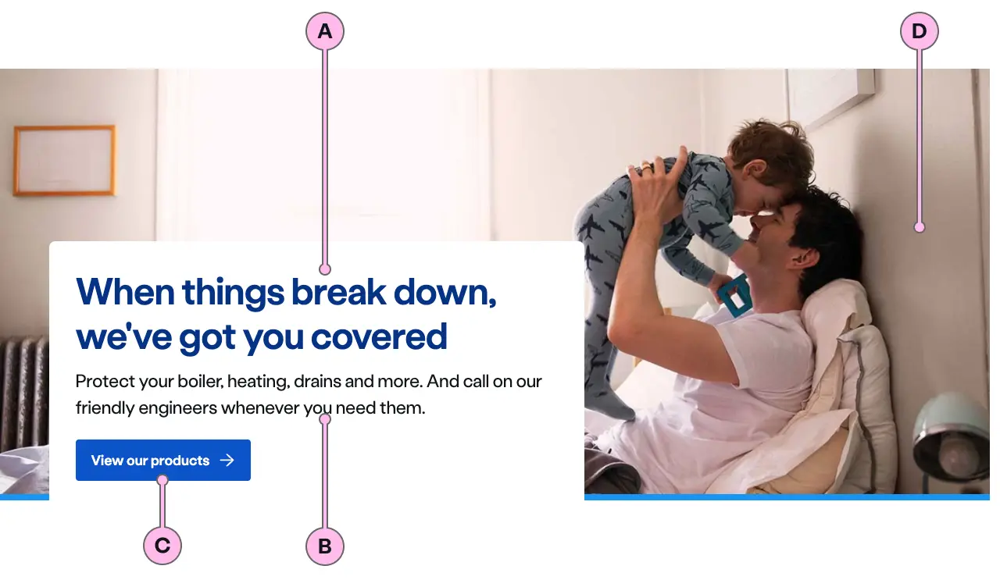
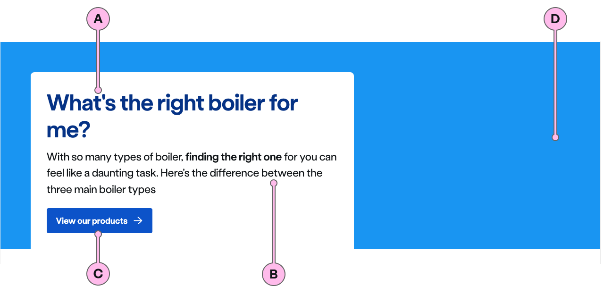
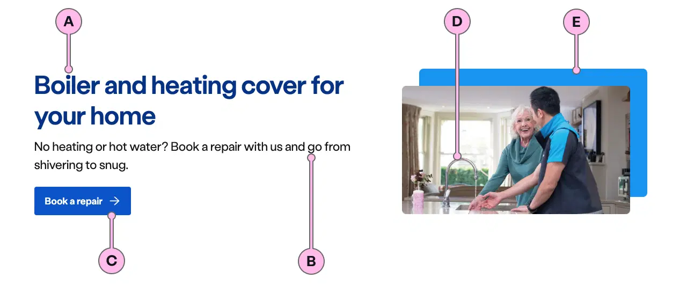
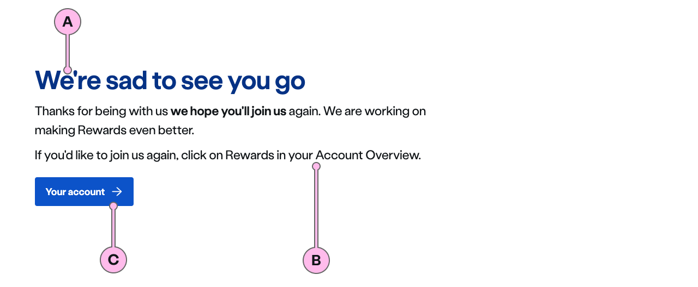

## Summit

| Key | Field type | Guidelines |
| :--- | :--- | :--- |
| A | Main Heading | The recommended length is between 4 and 12 words, not exceeding 50 characters in total. |
| B | Content | A single, short paragraph works best. Can contain bold copy `<b>`, inline links `<a>` and a caveat at the end of the relevant paragraph if required `<a href="#caveat">1</a>`. |
| C | Action | See action guidance below |
| D | Image path | This is the image that will be used inside `ns-landmark`. Ensure the important focus area of your image remains within the safe-area. It should have an aspect ratio of 16:9, the dimensions should be 1440x810 px, the file type should be jpg, and the file size should be no more than 150kb. Please make sure you work with a designer when selecting this image as finding the right one with the correct focus area can be challenging. **Note:** The image shouldn't hold any meaning and be only used as a decoration. This is why it doesn't have an `alt=""` attribute to avoid adding unnecessary content for users using assistive technology. |

## Hillside

| Key | Field type | Guidelines |
| :--- | :--- | :--- |
| A | Main Heading | The recommended length is between 4 and 12 words, not exceeding 50 characters in total. |
| B | Content | A single, short paragraph works best. Can contain bold copy `<b>`, inline links `<a>` and a caveat at the end of the relevant paragraph if required `<a href="#caveat">1</a>`. |
| C | Action | See action guidance below |
| D | Decoration | Apply a colour decoration to the landmark. [The specification table](#specification) has a list of options. |

## Valley

:::note
The purpose of the valley landmark is to present an overview of a product or service as a user moves down the funnel of their purchase journey. A CTA may be used, but is not recommended in scenarios where the objective is to encourage further on-page browsing.
:::

| Key | Field type | Guidelines |
| :--- | :--- | :--- |
| A | Main Heading | The recommended length is between 4 and 12 words, not exceeding 50 characters in total. |
| B | Content | Valley can accommodate multiple paragraph slots. However, be mindful of keeping it concise. To introduce a product or service we recommend 1 shot paragraph and three or four bullet point in a ticked list to showcase your key product benefits. It can contain bold copy `<b>`, inline links `<a>` and a caveat at the end of the relevant paragraph if required `<a href="#caveat">1</a>`. |
| C | Action | See action guidance below |
| D | Image path | This is the image that will be used inside `ns-landmark`.  It should have an aspect ratio of 4:3 or 16:9, the file type should be jpg, and the file size should be no more than 100kb. To see which image you can use - please see the Image Guidance section below. Don't use imagery with white backgrounds. Please make sure you work with a designer when selecting any imagery for the ns-landmark. **Note:** The image shouldn't hold any meaning and be only used as a decoration. This is why it doesn't have an `alt=""` attribute to avoid adding unnecessary content for users using assistive technology. |
| E | Decoration | Apply a colour to the offset. [The specification table](#specification) has a list of options. |

## Lakeside

| Key | Field type | Guidelines |
| :--- | :--- | :--- |
| A | Main Heading | The recommended length is between 4 and 12 words, not exceeding 50 characters in total. |
| B | Content | Lakeside can accommodate multiple paragraph slots. However, be mindful of keeping it concise. Our guidance is a minimum of 1 and a maximum of 3. Can contain bold copy `<b>`, inline links `<a>` and a caveat at the end of the relevant paragraph if required `<a href="#caveat">1</a>`. |
| C | Action | See action guidance below |

## Image

| Component | Variant | Ratio | Dimensions | Size | Type | Placeholder |
| :--- | :--- | :--- | :--- | :--- | :--- | :--- |
| `ns-landmark`| `summit` | 16:9 | 1440x810px | &lt; 200kb | jpeg | [ns-landmark-summit-1440x810px](https://user-images.githubusercontent.com/50207859/67642478-12140c80-f904-11e9-849d-5ffe39818c5b.jpg) |
| `ns-landmark`| `valley` | 4:3 | 720x540px | &lt; 100kb | jpeg | [ns-landmark-valley-720x540px](https://user-images.githubusercontent.com/50207859/67642153-d461b480-f900-11e9-9520-11204c64a11b.jpg) |

## Action

### CTA

* A CTA is optional and not recommended in scenarios where you want to encourage your user to explore content further down the page.
* If you need to include a CTA keep the text ‘short, relevant, and actionable’. It should not exceed more than 24 characters.

### Form

* A form is optional and recommended in scenarios where you need some information from the user to start a journey or dynamically change the content on the rest of the page.
* Don't use `ns-selector`, `ns-datepicker`, `nsx-address-selector`, or `nsx-marketing-consent` as these require more space than is available in the landmark.
* Keep forms short in `hillside` to avoid distorting and stretching the gradient.
