import Specification from '../../../../components/specification.astro';
import Placement from '../../../../components/placement.astro';

## Specification

<Specification name="ns-landmark" />

### Notes

#### Heading

* This needs to be a `h1` heading
* Main heading is a `` tag with a `h1` class.

#### Paragraph

* Include an optional link to `#caveat` by placing `<a href="#caveat">1</a>` at the end

### Summit - Image template

This provides the safe-area to the position of the focal point of the image.

[Download the 1440x810px Landmark testcard image](./images/summit-testcard.png) and place over your Landmark photos in your image editing software.

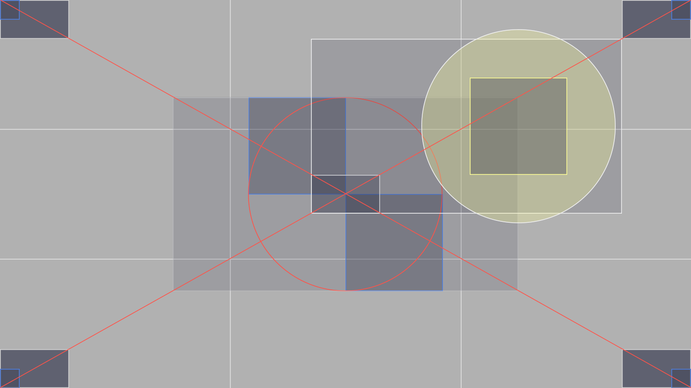

#### Using Photoshop

Using Photoshop to overlay the Landmark focus template to check alignment. (You could equally use an alternative software)

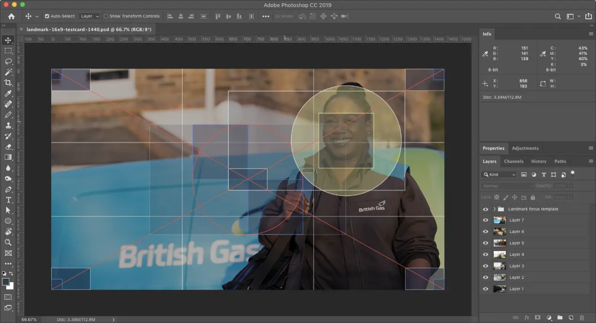

| 💚 Do | 💔 Don't |
| :--- | :--- |
| Here, the focus of the photo is located within the safe-area | The subject fills the entire photo, and the lady on the left will be obscured |
| 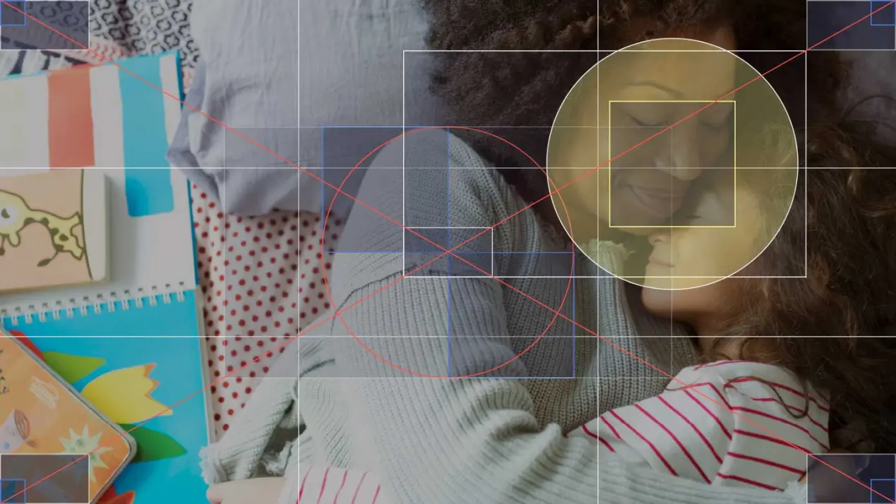 | 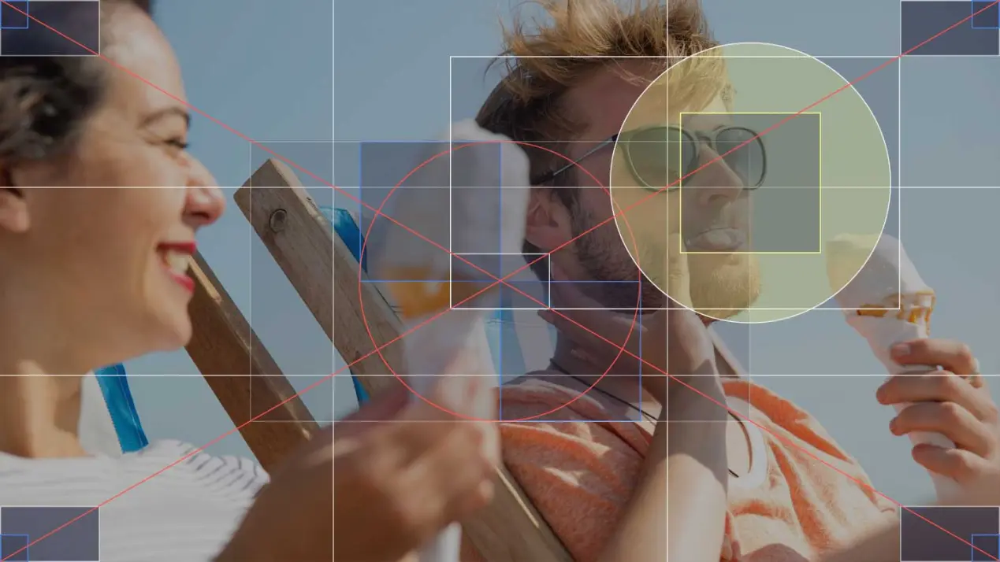 |
| Capture the story within. This photo is about the lady and her phone | Unfortunately, this photo is completely unsuitable for a Landmark |
| 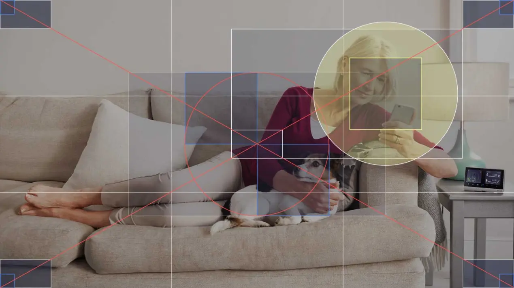 | 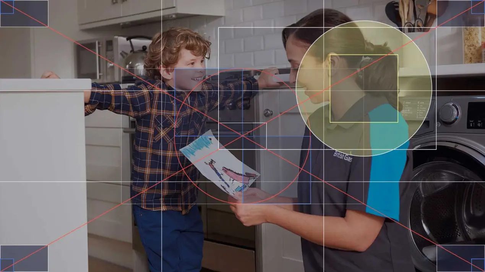 |

## Component placement

<Placement name="ns-landmark" />

## Best practice

| 💚 Do | 💔 Don't |
| :--- | :--- |
| Use it at the top of the page. | Use it in the middle or end of a page. |
| Communicate the primary purpose in a clear and concise way. | Always add a cta (It'll drive traffic away). |
| Content must be relevant to the page. | Use it to hold random content - `ns-editorial` may be better use for this. |
| Use decoration/lifestyle photography only. | Don't hold any meaning in the image. |

### `summit`

| 💚 Do | 💔 Don't |
| :--- | :--- |
| Capture the moment. | Allow the card to cover important content. |
| 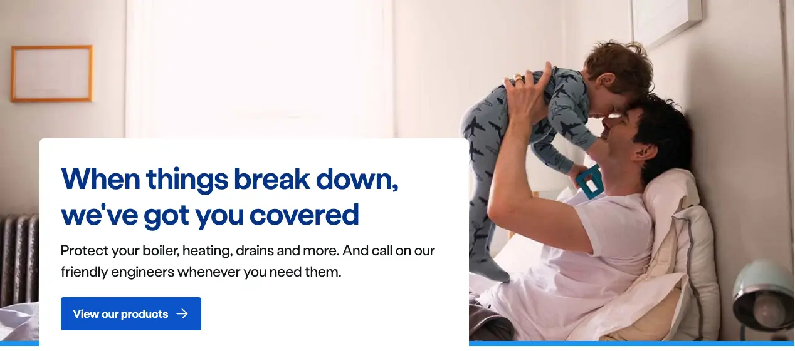 | 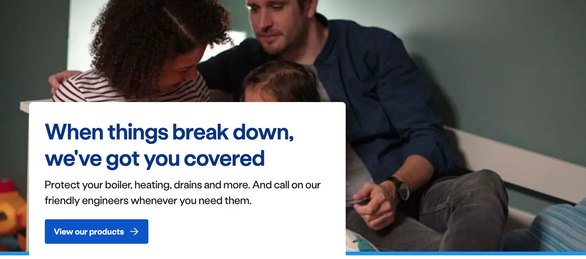 |
| Set focus of the photo correctly. | Obstruct people's faces with the card. |
|  |  |
| Convey activity related to topic. | Use images with a white background. |
| 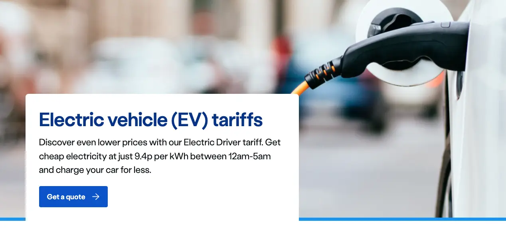 | 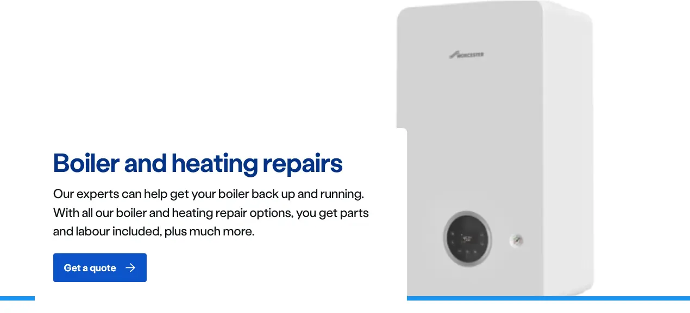 |

### `hillside`

| 💚 Do | 💔 Don't |
| :--- | :--- |
| Use the same colour for a set of pages on the same topic, e.g. Guide pages related to boilers. | Use the red decoration for something that is not a promotional promotional or an error-themed page. |
| 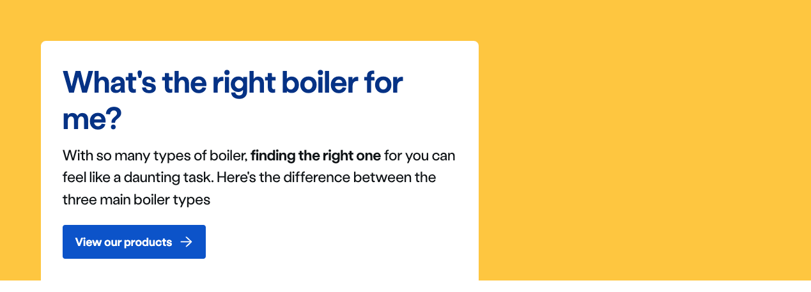 | Add too much content in the landmark. |
| Keep the content concise. |  |
| 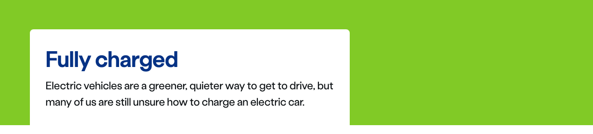 |  |

### `lakeside`

| 💚 Do | 💔 Don't |
| :--- | :--- |
| Use more than one paragraph. | Use more than three paragraphs. |
|  | 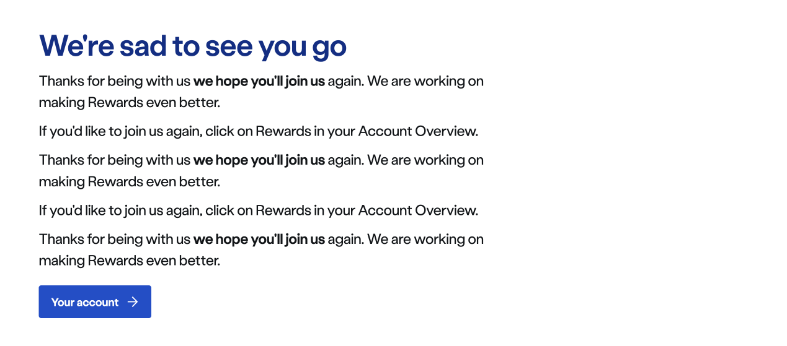 |
| Display 400 and 500 error pages. | Use to build a page. |
| 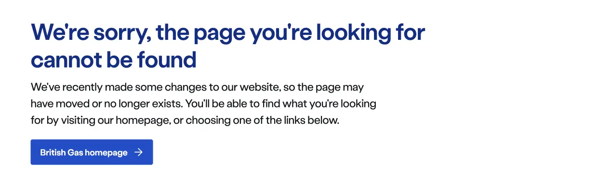 | 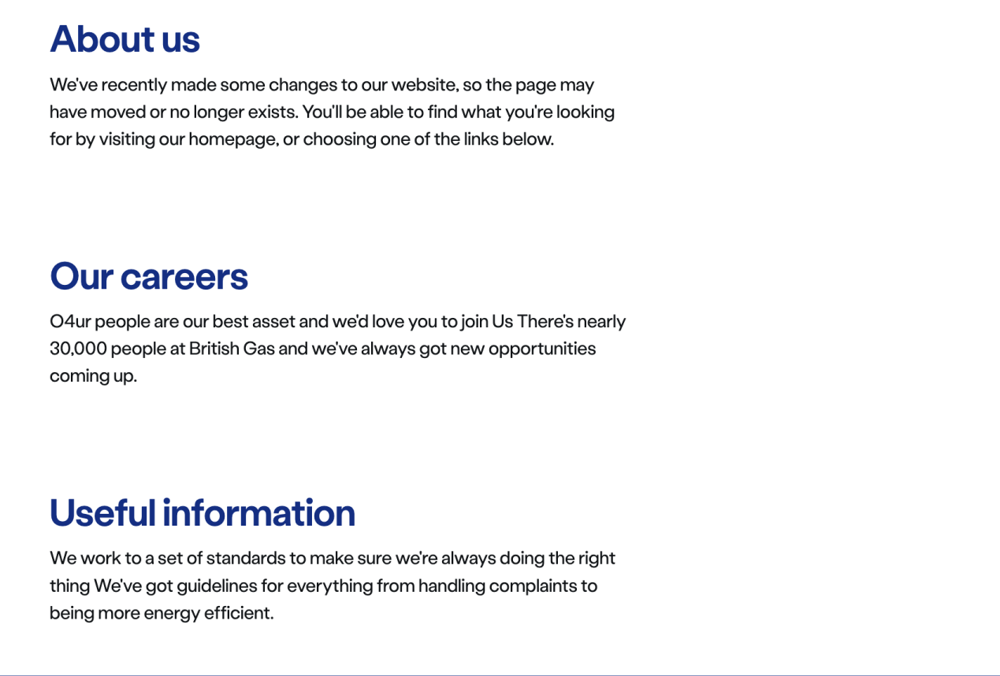 |
| Get to the point, in this scenario the Sub heading and CTA have been omitted. |  |
|  |  |

### `valley`

| 💚 Do | 💔 Don't |
| :--- | :--- |
| Use checked list to highlight your key product benefits | Add a CTA if the purpose of the page is for users to consume the content. |
| 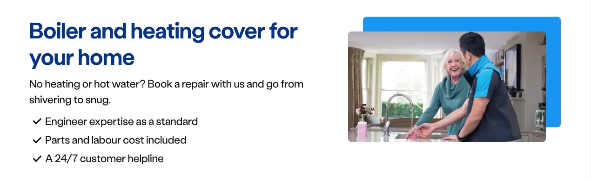 | 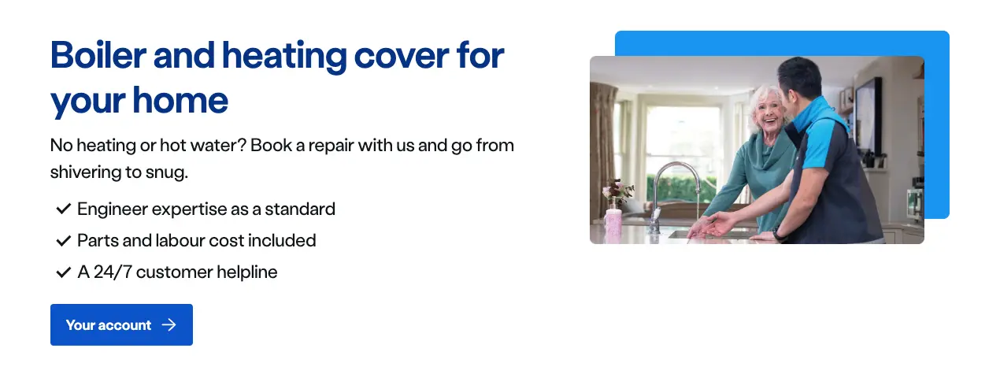 |
| Use a complementary image to add context to your product or service | Use long, verbose content. Keep the user interested with a snappy overview and draw them down the page |
| 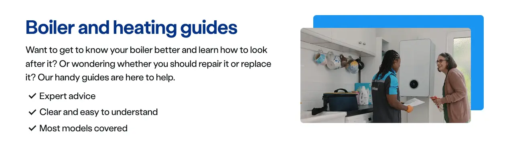 | 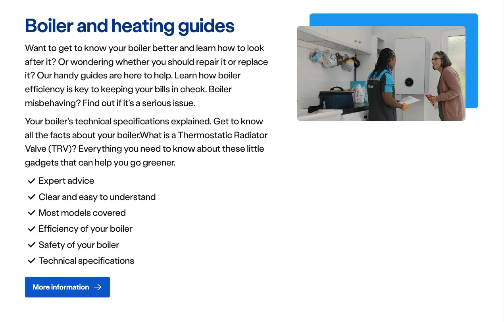 |
| Use colour, pill and ratio options for alternative aesthetics | Forget to use an image |
| 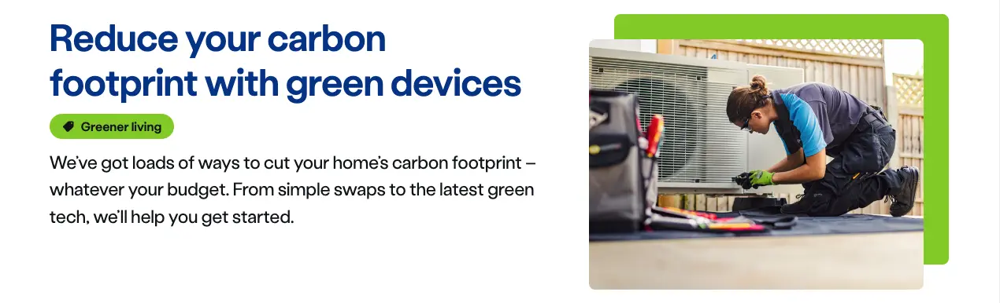 | 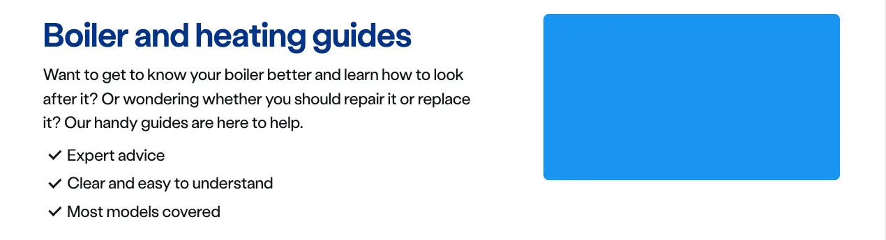 |

### Considerations

* Shorter and simpler words tend to work better in the heading.
* The recommended copy length is between 1 and 5 words for the Sub heading.
* The message must be in plain English, and help the user out of the situation by providing an actionable link if possible.
* If the purpose of the page is to understand more about a product or service, then it is considered bad practice to include a CTA within the landmark, as users are likely to drop out. This is because users believe the next step is to click the CTA, rather than reading the page to get a better understanding of how they should proceed.
* Let the page type define the type of landmark you use.
  * If the page purpose is to be informative / educational then we recommend using `hillside`.
  * If the page purpose is promotional we recommend using `summit`.
  * If the page purpose is a 400 or 500 error page, use `lakeside`.
  * If the page purpose is to showcase features and products, use `valley`.
* If you are designing a series of informative / educational pages that all follow a similar theme, it would be considered best practice to use the same coloured decoration within the `hillside`.
