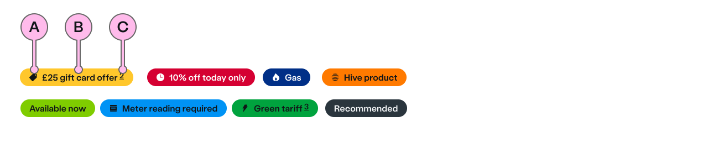

## Introduction

> A pill is a small coloured highlight which can be used to draw a customer's attention to a piece of information.

Pills can be used to highlight a small item of key information to a customer. Within the British Gas experience, they should be used to attract attention to a promotional message or a notification. They should only be used to display a small detail of content and are not intended to contain lengthy or complex information.  

Pills can help to create a subtle sense of urgency or to draw a customer’s attention to the value of a product or service. For example, they can be used to highlight the date that a promotional offer expires, or to feature a gift offer.

## Content guidance

| Key | Field type | Guidelines |
| :--- | :--- | :--- |
| A | Icon | Use an icon to support your description. |
| B | Content | Content should be very concise and catchy, ideally between 1 and 4 words. Your content should not run over one line on a `squash-court` viewport. |
| C | Caveat | Use a link to a caveat. (See [ns-caveat](ns-caveat)) |

**Tip:** Short and snappy content that can be quickly absorbed at a glance has been shown to perform better than longer promotional content.  

## Best practice

| 💚 Do's | 💔 Don'ts |
| :---  | :---  |
| Use solid versions of icons | Use as validation messages |
| Use `ns-pill` very sparingly, ideally one or two per journey maximum. Less is more. | Create a shouty experience by using `ns-pill` in multiple places. It dilutes the impact.  |
| Use a `yellow` pill to draw attention to an offer or promotional message. | Create distraction or put undue pressure on customers to purchase unwanted or irrelevant products by overusing urgency elements. |
| Use `red` and `lime` pills for dashboard notifications.  | Don’t use pills near a text CTA. Pills should not detract attention from your users’ next action. |
| Keep your copy short and simple for maximum impact. | Use in the middle of a sentence |
| Use `ns-pill` in a component with a direct CTA | Use the `ns-pill` as a link or button. (Caveat link excepted). |
| Choose colours that are consistent and relevant | Use icons that can make `ns-pill` visually appear like an interactive component, for example an `ns-cta` or drop-down `ns-inputter/select`. |
|  | Use `ns-pill` as a heading |

### Considerations of best practice

#### Multiple pills

Multiple pills within a journey will create a distracting and overwhelming experience for users. Please read our guidelines below carefully and use this component sparingly.

#### Colour usage

Colour should be used consistently with pills throughout the customer journey.  

A `yellow` pill is used to draw attention to an offer of promotional message.  

A `red` or `lime` pill can be used to drawing attention to important customer information or notification. For example, within a dashboard context, `red` can be used to indicate an ‘expired’ item and `lime` to indicate a ‘new’ item or `forest` for ‘success’.

There are a range of colours to choose from (see the specifications below). Try to use those that are consistent with existing usage, and relevant to subject (eg. Orange for Hive products).

## Usage

<StorybookStory story="components-ns-pill--standard"></StorybookStory>

## Component placement

<ComponentPlacement component="ns-pill" parentComponents="ns-card,ns-selector,ns-landmark"></ComponentPlacement>

## Specification

| Attribute | Type | Default | Options | Description |
| :--- | :--- | :--- | :--- |-------------|
| `colour` | `string` | `slate` | `cyan`, `lime`, `navy`, `forest`, `slate`, `orange`, `red`, `yellow` | The colour of the pill |
| `icon` | `string` |  |  See [`ns-icon` component icon types](../components/ns-icon) | The icons to show inside the pill |

## Specification notes

When an icon is supplied the pill will use the media object pattern.

## Feedback

* Do you have insights or concerns to share? You can raise an issue via [Github bugs](https://github.com/ConnectedHomes/nucleus/issues/new?assignees=&labels=Bug&template=a--bug-report.md&title=[bug]%20[ns-pill]).
* See all the issues already raised via [Github issues](https://github.com/connectedHomes/nucleus/issues?utf8=%E2%9C%93&q=is%3Aopen+is%3Aissue+label%3ABug+[ns-pill]).

<PageFooter></PageFooter>

## Related links

* [ns-card](/components/ns-card)
* [ns-selector](/components/ns-selector)
* [ns-landmark](/components/ns-landmark)
