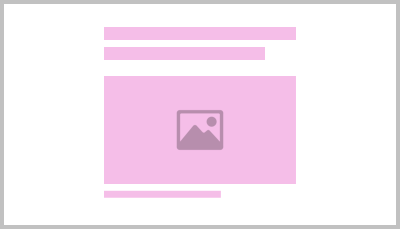
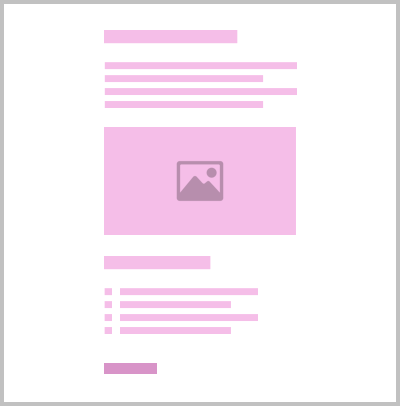

import PageViewer from '@components/PageViewer.astro';

## Introduction

Article pages are used to inform the user about something. They can take the form of a **blog** or **news item** and have been specifically designed to make it easy for the reader to absorb the information. The article page utilises a short distance for the reader's eyes to pan horizontally. Articles are typically read from start to finish.

They allow long form content with images and sections, with very little effort required by the author to achieve the layout of the content, meaning it is an ideal format for regular updates and breaking news where speed of release is important. The article page  can be effective for marketing and can also be a useful as an SEO (Search Engine Optimisation) tool – helping to drive traffic to the site.

### Purpose

- To promote news, blog or marketing.
- A quick and easy way to create a page where speed of release may be important.
- Helps the website contain fresh and regularly updated content.
- To gain and develop a person's interest in a topic that could lead to action.

## Example

<PageViewer />

## Content guidance

Write content to grab attention, create interest, sell the benefits and make the person reading it desire something. Then provide a call to action for them. Use images, bullet points or numbered lists to help convey information and enrich the experience.

:::tip[Principles]
- **Creative** - Modern and dynamic
- **Tone of voice** - Persuasive, Beneficial
- **Keywords** - Promotional, Informative
:::

| Page&nbsp;composition | Description |
| :--- | :--- |
|  | This page will always start with [`<nsx-header>`](/components/nsx-header) providing the primary navigation for the website, whilst also being our main brand presence. |
|  | Use a compelling but concise headline that would make someone want to click it, if it were to be seen as a link elsewhere. Immediately below the h1 is a relative [`<ns-image>`](/components/ns-image) with a 16:9 ratio and a caption to grab attention and sell the story. The image should convey the headline and the caption should describe the image. See [`<ns-article>`](/components/ns-article) for more information. |
|  | Following that there is the main body of content, which can be made up from h2-h6 and paragraph text, links, lists, further images and captions and CTAs. It can also be broken in to sections (like chapters) visually indicated by a set of 3 dots. See [`<ns-article>`](/components/ns-article) for more information. |
|  | Finally, there is [`<nsx-footer>`](/components/nsx-footer) which holds all required links and copyright information for the website. It is also an important SEO tool as it includes links to social channels and our mobile apps. |
