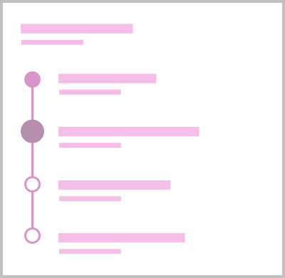
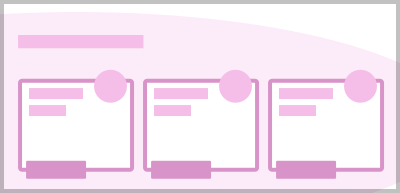
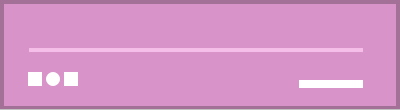

import PageViewer from '@components/PageViewer.astro';

## Introduction

The confirmation page type is used to show a customer that their journey or task has been completed. 

It is important to differentiate from previous stages.

### Purpose

- To reassure the customer that a task was completed.
- To play back relevant information.
- To set expectations of any further steps required.

For more information on how to bookend your journeys [see the Start page type](/page-types/start).

## Example

<PageViewer />

## Content guidance

The page should always begin with a clear completion message.

Any key information the customer needs to remember or save for a later date should be presented at the top of the page. This might include:

- Any reference numbers.
- An appointment date and/or time.
- A start or end date.
- The duration of a product or service.
- An address or contact information.

This page will inform the customer that they have successfully completed their current task, and set their expectations for any further steps required. 

You can use supporting content to play back their purchase and inform them of what will happen next. If the customer is required to complete any additional follow up tasks, then those should be positioned as close to the top of the page as possible.

:::tip[Principles]
- **Creative** - Clean and fresh
- **Tone of voice** - Be helpful
- **Keywords** - Functional, Informative
:::

| Page&nbsp;composition | Description |
| :--- | :--- |
|  | This page will always start with [`<nsx-header>`](/components/nsx-header) providing the primary navigation for the website, whilst also being our main brand presence. |
|  | Next is [`<ns-landmark>`](/components/ns-landmark) showing a clear completion message. Any key information the customer needs to remember or save for a later, such as appointment details should be presented here. |
|  | Below the message can be [`<ns-timeline>`](/components/ns-timeline) that shows a status overview of the whole process whilst setting expectations for the further steps. |
|  | Following that, there can be supplementary content that consists of more [`<ns-card>`](/components/ns-card) components, consider introducing a decoration that is sympathetic to the surrounding aesthetics. |
|  | Finally, there is [`<nsx-footer>`](/components/nsx-footer) which holds all required links and copyright information for the website. It is also an important SEO tool as it includes links to social channels and our mobile apps. |

### Confirmation email

In addition to this page, a confirmation email containing this information should be sent to the customer. This is especially important if the customer cannot bookmark or revisit this page once they have navigated away from it.
