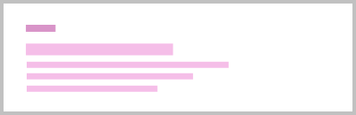
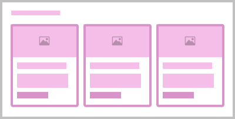
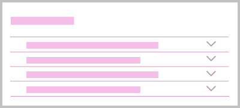

## Introduction

Product pages introduce more granular detail than hub pages. They often display pricing, product terms and promotion details. Primary actions on the page drive customers into the sales journey, and conversion rate should be measured into these journeys to deduce how to optimise page performance.

### Purpose

- Immediately convey the value of the featured product (or service).
- Explain the key features of the the product or service, this could be visually or verbally.
- Make customers believe this is the product or service they need.
- Convince the customer of the product offering to drive them into the top of the sales funnel.
- Carry all relevant legal or regulatory information (this could be a link to or caveat etc) required for the product & service offerings on the page.
- Direct users to more information if they’re not at the sales part of their buying journey.

## Example

  
<a href="https://www.britishgas.co.uk/nucleus/demo/iframe.html?id=examples-page-types--product&amp;viewMode=story">View full page example</a>

  <iframe src="https://www.britishgas.co.uk/nucleus/demo/iframe.html?id=examples-page-types--product&amp;viewMode=story&amp;nav=0" title="Nucleus: examples-page-types--product" sandbox="allow-forms allow-modals allow-popups allow-presentation allow-same-origin allow-scripts"></iframe>

## Content guidance

Use images of the product itself, or if that isn't tangible, the items it affects. Show clarity in pricing and create a persuasive call-to-action (CTA). Write informative product descriptions for the uninitiated. Leverage social proof where possible. Provide accurate product recommendations and remain consistent. 

There are different types of products, so you will need to assess your individual product's requirements, but you may find the following composition guidelines of use.

:::tip[Principles]
- **Creative** - Modern and dynamic
- **Tone of voice** - Be active, Be natural
- **Keywords** - Promotional, Informative
:::

| Page&nbsp;composition | Description |
| :--- | :--- |
|  | This page will always start with [`<nsx-header>`](/components/nsx-header) providing the primary navigation for the website, whilst also being our main brand presence. |
|  | Use the [`<ns-landmark>`](/components/ns-landmark) component (lakeside) with a prominent, compelling, value proposition. Clearly and concisely describe the product and any offer, to confirm to the user the page they have opened. It effectively brings CTAs further up the page and into view, which in theory should increase conversions (the use of a single CTA here could also work in the absence of multiple choices). Optionally, you could include an [`<ns-pill>`](/components/ns-pill) component to highlight the offer.|
|  | Conversions may be increased if the [`<ns-product-card>`](/components/ns-pill) or [`<ns-card>`](/components/ns-card) (support with image type) CTAs are high up in the order of a product page – situating them in the most visually scanned areas. Use images that conform to [`<ns-image>`](/components/ns-image) 16:9 aspect ratio, and help communicate the product. It can also make comparisons easier. |
|  | Explain the main benefits of the product. Perhaps tell a story or link to one. This could be in the form of a list within the [`<ns-content>`](/components/ns-content) or [`<ns-lockup>`](/components/ns-lockup) components.  |
|  | Leverage social proof by including things like TrustPilot reviews or the [`<ns-testimonial>`](/components/ns-testimonial) component. TrustPilot can be of more value to the user as the content is honest and not curated by our business. However, in some cases, using the ns-testimonial component may be more appropriate and utilises the company's brand aesthetic in the section. |
|  | Highlight related products, services or links to guides etc. using [`<ns-lockup>`](/components/ns-lockup) component, but keep this lower down the page than the main product information. |
|  | Use the [`<ns-accordion>`](/components/ns-accordion) component to display any FAQs. If a user has scrolled this far they are likely to have unanswered questions. You may also want to consider including live chat support like 'Cosmo' (British Gas). |
|  | Following that we should display any caveats or legal information using the [`<ns-caveat>`](/components/ns-caveat) component.  |
|  | Finally, there is [`<nsx-footer>`](/components/nsx-footer) which holds all required links and copyright information for the website. It is also an important SEO tool as it includes links to social channels and our mobile apps. |
