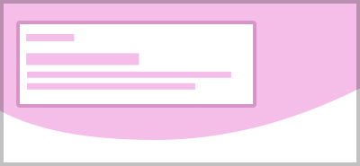

import PageViewer from '@components/PageViewer.astro';

## Introduction

This page type should be used to clarify and set up a task for a user at the beginning of a journey.

### Purpose

- This page sets expectations.
- It provides any contextual information that a user may need to complete their journey successfully. 

For more information on how to bookend your journeys [see the Confirmation page type](/page-types/confirmation).

## Example

<PageViewer />

## Content guidance

The page composition below provides a suggestion of the typical content that is may be required at this stage in the user's journey. This is not prescriptive guidance, and the unique needs of each journey should always also be considered. 

A dedicated start page may not be needed if users are coming from a page where their expectations have already been set. This page may also vary in shorter journeys, particularly where form elements may need to be present at the first step.

:::tip[Principles]
- **Creative** - Modern and dynamic
- **Tone of voice** - Be active, Be natural
- **Keywords** - Promotional, Informative
:::

| Page&nbsp;composition | Description |
| :--- | :--- |
|  | This page will always start with [`<nsx-header>`](/components/nsx-header) providing the primary navigation for the website, whilst also being our main brand presence. |
|  | Next is [`<ns-landmark>`](/components/ns-landmark) which clarifies the task at hand for the user. This should have a welcoming tone. |
|  | Below the Landmark is [`<ns-content>`](/components/ns-content) including an instructional heading with an unordered list to outline any information that the user needs to know to complete the journey. It also includes a prominent direct [`<ns-cta>`](/components/ns-cta). |
|  | Then there is a section with 3 [`<ns-card>`](/components/ns-card) components that link to relevant help and support content. It may also include signposting to a secondary journey, or action for frequently misdirected users. Decorative background elements should be adapted to create balance with the surrounding page elements. |
|  | Finally, there is [`<nsx-footer>`](/components/nsx-footer) which holds all required links and copyright information for the website. It is also an important SEO tool as it includes links to social channels and our mobile apps. |
